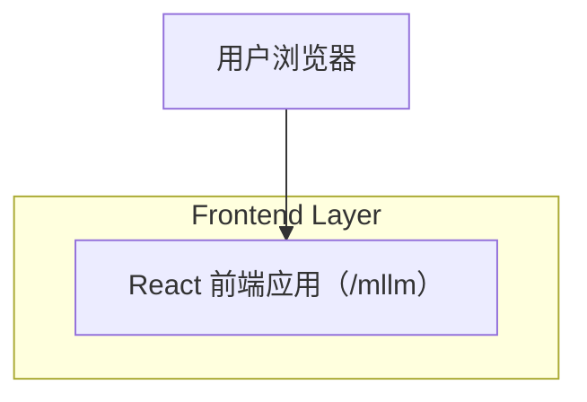

## 1.Architecture design

## 2.Technology Description
- Frontend: React@18 + TypeScript + vite
- UI/样式: tailwindcss@3（现有）+ CSS Variables（主题 Token）；antd（全局主题已存在，用于应用级 Token 统一）
- Backend: 无（本需求仅涉及前端主题与布局调整，不新增 API）

## 3.Route definitions
| Route | Purpose |
|---|---|
| /mllm | MLLM 控制台：顶部 Tab 栏 + 投屏友好浅色主题 |

## 4.Implementation notes（前端落地要点）
### 4.1 主题与色值（以 Token 形式统一，避免散落硬编码）
- 必须遵循你指定 RGB 色系：
  - 页面背景：#FFFFFF
  - Tab 强调边框/主色：rgb(95, 2, 107)
  - 画布背景：rgb(252, 248, 242)
  - 卡片/函数块背景：rgb(227, 212, 229)
- 建议做法：
  1) 在 /mllm 根容器挂载 data-theme="cast-light"，并在 CSS 中定义变量（:root 或 [data-theme] 均可）。
  2) 将 Tab、容器、卡片、画布等组件只消费变量（例如 var(--mllm-canvas-bg)），保证一致性与可维护性。

### 4.2 “左侧导航改顶部 Tab 栏”结构调整
- 当前 /mllm 内部为“左侧 nav + main 内容”，需要改为：
  - TopTabs（固定高度，含产品标识区可选 + 7 个 Tab）
  - MainContent（可滚动内容区，渲染当前 activeSection 对应内容）
- 状态保持：沿用现有 activeSection（useState 或既有 store），仅迁移渲染位置与样式。
- 可达性：TopTabs 用 button 语义并补充 aria-current/aria-selected；focus ring 使用主色加粗，确保投屏可见。

### 4.3 与应用外壳（AppShell）的衔接
- 现状：AppShell 对 /mllm 隐藏全局 TopBar 且 Content 背景为深色。
- 目标：/mllm 由自身提供顶部 Tab 栏，因此建议 AppShell 继续隐藏全局 TopBar，但将 /mllm Content 背景调整为浅色（#FFFFFF）并取消深色底带来的“投屏发灰”。

### 4.4 视觉一致性与投屏可读性
- 用“边框 + 留白”为主表达层级，阴影克制；关键交互（选中、hover、focus）至少用 1 个非颜色维度增强（描边粗细/下划线高度/轻微位移）。
- 字号建议：基础 16px；顶部 Tab 文本 14–16px；当前 Tab/页面标题 18–20px。

## 5.Server architecture diagram (If it includes backend services)
本需求不新增后端服务，略。

## 6.Data model(if applicable)
本需求不新增/变更数据模型，