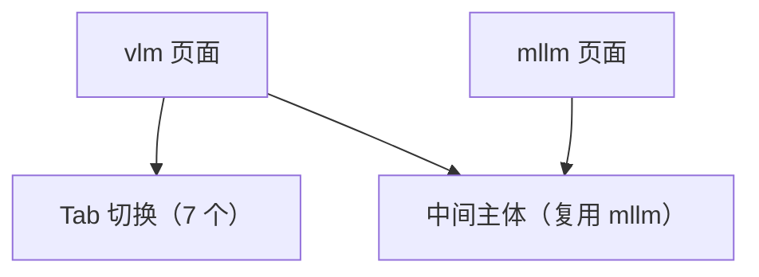

## 1. Product Overview
将既有的 mllm 页面“中间主体”前台完整复用到 vlm 页面，并将 vlm 顶部导航/工具栏替换为 gaasd 形式，新增 7 个中文 Tab 用于切换。
本需求仅涉及前端页面结构与导航样式改造，不改变中间主体的现有内容与交互。

## 2. Core Features

### 2.1 Feature Module
本次改造涉及以下页面：
1. **mllm 页面**：作为现有前台主体的来源（不改动）。
2. **vlm 页面**：复用 mllm 中间主体；顶部替换为 gaasd 顶栏/工具栏；提供 7 个中文 Tab 切换。

### 2.2 Page Details
| Page Name | Module Name | Feature description |
|-----------|-------------|---------------------|
| mllm 页面 | 中间主体（既有） | 保持现有布局与交互不变，作为 vlm 页面主体复用源。 |
| vlm 页面 | gaasd 顶栏 | 展示 gaasd 风格顶栏（菜单式 TopBar），样式与交互对齐既有 gaasd 形态。 |
| vlm 页面 | gaasd 工具栏 | 展示 gaasd 风格工具栏（图标+文字按钮区），样式与交互对齐既有 gaasd 形态。 |
| vlm 页面 | 顶部 Tab 区（7 个） | 提供 7 个中文页签用于切换；支持点击切换当前激活 Tab 的高亮状态。 |
| vlm 页面 | 中间主体（复用） | 复用 mllm 页面中间主体的前台实现；保持结构、内容、交互“原样一致”。 |

## 3. Core Process
- 用户进入 vlm 页面后，首先看到 gaasd 顶栏与 gaasd 工具栏。
- 用户可在顶部 Tab 区点击任一中文 Tab，页面更新 Tab 激活状态（高亮/指示）。
- 页面中间主体区域始终保持与 mllm 页面一致（不因 Tab 切换而改变）。

