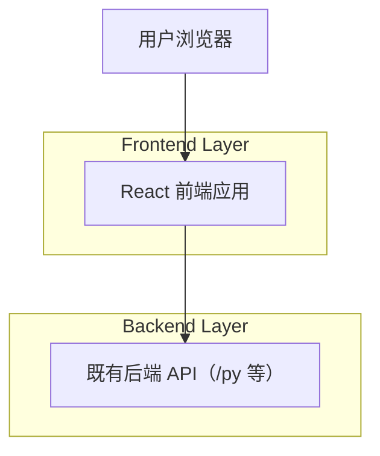

## 1.Architecture design

## 2.Technology Description
- Frontend: React@19 + vite@6 + tailwindcss@4 + lucide-react
- Backend: 既有服务（通过 HTTP 调用 /py 路径的接口；本需求不新增/不改动 API）

## 3.Route definitions
| Route | Purpose |
|-------|---------|
| /mllm | mllm 页面（现有基准：提供被复用的“中间主体”实现） |
| /vlm | vlm 页面（复用 mllm 中间主体；顶栏/工具栏替换为 gaasd 形态；新增 7 个中文 Tab） |

备注：若当前工程暂未引入路由，则以上可映射为同一单页内的两个“页面视图/入口”。
