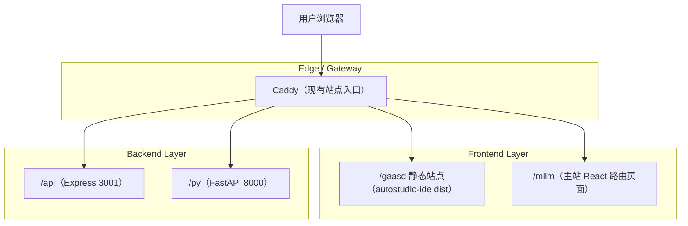

## 1.Architecture design

## 2.Technology Description
- Frontend（autostudio-ide）: React@19 + Vite@6 + TailwindCSS@4 + TypeScript@5
- Backend: None（当前工程仅前端 UI；package.json 中的 express/better-sqlite3 暂未在 src 里使用）

## 3.Route definitions
| Route | Purpose |
|-------|---------|
| /gaasd/ | Autostudio IDE 主界面（单页应用入口） |
| /gaasd/* | 子路径静态资源与 SPA fallback（由网关 try_files 到 /gaasd 的 index.html） |
| /mllm | 现有 MLLM 工作台（主站路由，不应受影响） |
| /api/* | 现有 Express API（不应受影响） |
| /py/* | 现有 FastAPI API（不应受影响） |

## 7.工程结构与模块职责（补充）
### 7.1 目录结构（现状）
- autostudio-ide/
  - index.html：Vite 入口 HTML
  - vite.config.ts：Vite 构建配置（当前未设置 base）
  - src/
    - main.tsx：React 挂载入口
    - App.tsx：页面骨架（TopBar / Toolbar / Workspace）
    - components/Layout/
      - TopBar.tsx：顶部菜单栏（下拉菜单交互、点击外部关闭）
      - Toolbar.tsx：工具条快捷按钮区（静态按钮组）
      - Workspace.tsx：IDE 工作区（可拖拽分栏、画布 Tab、日志/流水线、需求/属性面板）

### 7.2 关键 UI 组成（现状）
- 顶部区：TopBar（多级菜单） + Toolbar（常用操作入口 + 目标平台状态）
- 中央工作区：react-resizable-panels 实现「左侧栏 / 中央画布 / 右侧栏」可调布局
- 画布（Canvas）：多 Tab、重命名、增删 Tab、网格背景与悬浮工具条（当前为占位内容）
- 底部日志（OperationLog）：含“代码检测”Tab 与流水线步骤状态机（pending/running/success/failure，当前为模拟执行）
- 右侧：RequirementPanel（需求/QA/LLM 调用/提示词占位） + AttributesPanel（属性/交互占位）

### 7.3 实现方案建议（在不改变现有 UI 骨架前提下）
- 状态分层：
  - UI 状态（面板开关、选中项、Tab）保留在组件内或提到轻量 store（如 Zustand）
  - 领域状态（工程、画布节点、构建流水线）抽到单独 domain 模块，避免 Workspace.tsx 继续膨胀
- 可扩展点：
  - 将“菜单/工具条动作”统一路由到 command bus（commandId + payload），便于后续接入快捷键、脚本化
  - 将“流水线步骤”抽象为可配置 steps（label + handler），从“模拟执行”平滑过渡到真实编译/检测调用
- 与现有后端协作（可选）：若未来需要真实编译/检测/代码生成，优先复用现有 /api 或 /py，新增命名空间例如 /api/gaasd/*，避免影响 /mll