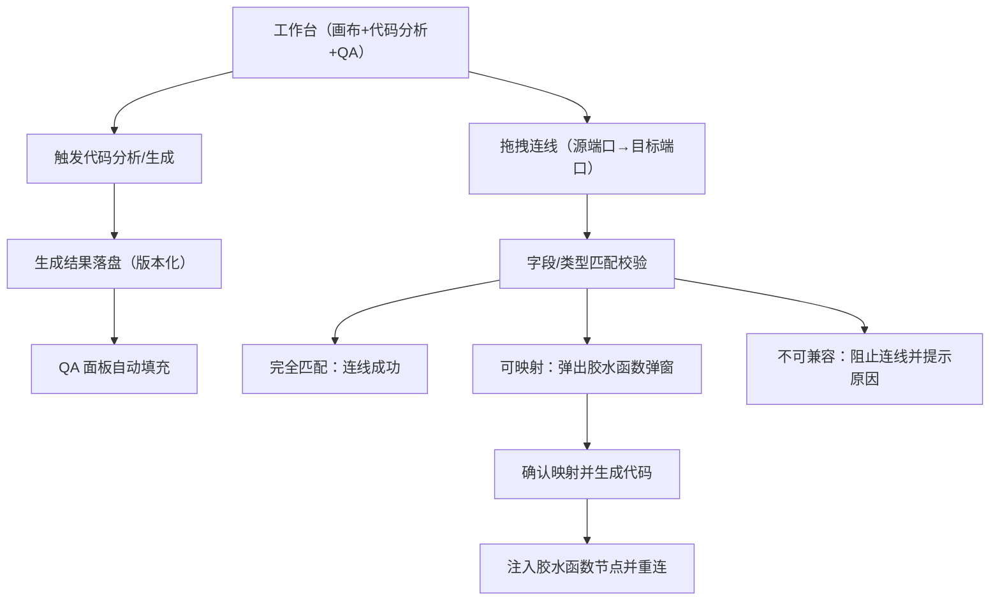

## 1. Product Overview
提升“代码分析→QA 自动填充”的可靠性，避免生成后 QA 面板为空。
在画布连线时增加字段匹配校验，不匹配时引导生成胶水函数并自动注入画布以完成兼容。

## 2. Core Features

### 2.1 User Roles
本需求不涉及角色差异。

### 2.2 Feature Module
本次需求主要涉及以下页面：
1. **工作台（画布+代码分析+QA）**：代码分析生成、QA 自动填充展示、画布连线与校验、胶水函数弹窗与注入。

### 2.3 Page Details
| Page Name | Module Name | Feature description |
|-----------|-------------|---------------------|
| 工作台（画布+代码分析+QA） | 代码分析生成 | 触发代码分析/生成并产出结构化结果（含字段定义、接口输入输出、建议 Q/A）。 |
| 工作台（画布+代码分析+QA） | QA 自动填充修复 | 在代码分析/生成完成后自动将建议 Q/A 填充到 QA 面板：
- 以“生成任务/版本号”为键做幂等更新，避免旧结果覆盖新结果
- 处理异步竞态（生成中切页/重复点击/取消）仍可正确落盘并回显
- 生成失败或结果为空时给出明确提示与重试入口 |
| 工作台（画布+代码分析+QA） | 画布连线字段匹配校验 | 当用户从源节点输出端口连到目标节点输入端口时，校验字段/类型是否可兼容：
- 完全匹配：允许连线
- 可通过映射兼容：提示并允许进入胶水函数生成
- 不可兼容：阻止连线并提示原因 |
| 工作台（画布+代码分析+QA） | 胶水函数生成弹窗 | 在字段不匹配（但可通过转换兼容）时弹窗：
- 展示源/目标字段列表与差异说明
- 提供自动推荐的字段映射（可编辑）
- 一键生成胶水函数代码（可复制/可编辑） |
| 工作台（画布+代码分析+QA） | 胶水函数注入画布 | 用户确认后自动在画布中插入“胶水函数节点”并重连：
- 断开原连线（若已创建）
- 新增胶水节点（输入=源输出，输出=目标输入）
- 创建两条新连线（源→胶水、胶水→目标）
- 将映射配置与生成代码绑定到该节点的属性中 |

## 3. Core Process
### 3.1 代码分析→QA 自动填充
你在工作台触发“代码分析/生成”。生成完成后系统将结果落盘到当前任务（或当前画布）对应的“生成版本”，并自动用该版本的建议 Q/A 填充 QA 面板；若你在生成期间重复触发或切换模块，系统也只会以最新版本为准进行回显，避免出现 QA 为空或被旧数据覆盖。

### 3.2 画布连线校验→胶水函数注入
你在画布上拖拽连线，系统在松开鼠标/触发连接提交时进行字段匹配校验：
- 若完全匹配，连线直接成功。
- 若存在字段名/类型差异但可映射，系统弹出胶水函数生成弹窗；你确认映射后，系统在画布自动插入胶水函数节点并完成重连。
- 若不可兼容，系统阻止连线并解释原因（例如缺失必填字段或类型无法转换）。

