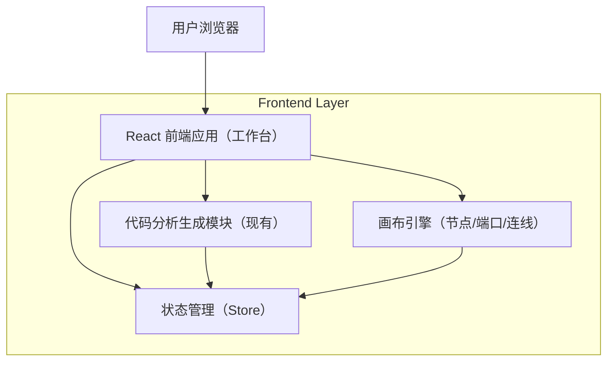

## 1.Architecture design

## 2.Technology Description
- Frontend: React@18 + TypeScript + Vite
- Backend: None（复用现有“代码分析生成”实现；本需求不新增服务端）

## 3.Route definitions
| Route | Purpose |
|-------|---------|
| /workspace | 工作台：画布编辑、代码分析生成、QA 面板、连线校验与胶水函数注入 |

## 4.API definitions (If it includes backend services)
本需求不新增后端 API。若“代码分析生成”已有内部 API，沿用即可。

## 6.Data model(if applicable)
本需求主要新增/明确前端领域模型（可序列化到现有任务/画布存储结构中）。

### 6.1 Data model definition
- GenerationRun（一次生成运行）
  - id: string（唯一）
  - status: 'running' | 'success' | 'failed' | 'canceled'
  - startedAt/endedAt
  - analysisResult: { portsSchema, suggestedQA[] } | null
  - errorMessage?: string

- SuggestedQA
  - question: string
  - answer: string
  - source: 'analysis'

- CanvasPortSchema
  - portId: string
  - direction: 'input' | 'output'
  - fields: FieldDef[]

- FieldDef
  - name: string
  - type: string（例如 string/number/boolean/object/array 或你现有的类型系统）
  - required: boolean

- GlueNode（画布节点类型：胶水函数）
  - id: string
  - kind: 'glue_function'
  - inputSchema: FieldDef[]
  - outputSchema: FieldDef[]
  - mapping: FieldMapping[]
  - code: string

- FieldMapping
  - from: string（源字段路径）
  - to: string（目标字段路径）
  - transform?: string（可选：转换表达式/函数片段）

### 6.2 关键实现策略
#### 6.2.1 修复“生成后 QA 自动填充为空”
问题归因（典型）：
- 生成完成回调晚于 UI 状态重置（例如切换任务/切换 tab 导致 QA store 清空）。
- 多次触发生成引发竞态：旧请求后返回覆盖新请求结果。
- analysisResult 的字段路径变化，QA 填充读取不到（静默失败）。

落地策略：
1) 版本化写入：以 GenerationRun.id 作为版本号；UI 只订阅“当前激活版本”的 suggestedQA。
2) 幂等合并：写入 suggestedQA 前做空值保护与 schema 校验；若 analysisResult.suggestedQA 为空则保持上一次成功版本并提示“本次未生成 QA”。
3) 竞态防护：
- 发起生成时将 activeRunId=新 id；
- 任何回写必须校验 runId===activeRunId 才能更新 QA 面板。
4) 生命周期一致性：切页/卸载时不清空成功数据；仅在显式“清空/新建任务”动作时清空。
5) 可观测性：在生成完成、写入 QA、QA 读取渲染三处打点日志（含 runId、QA 数量、失败原因）。

#### 6.2.2 画布连线字段匹配校验
触发时机：
- onBeforeConnect(sourcePortId, targetPortId)：预校验（用于提示/阻止）。
- onConnectCommit：最终校验（确保一致）。

校验规则（最小可用）：
1) 方向校验：source 必须为 output，target 必须为 input。
2) 字段匹配：
- 完全匹配：target.required 字段在 source.fields 中同名同类型存在；且 source 字段类型与 target 字段类型相等。
- 可映射：target.required 字段在 source 存在但名称不同或类型可转换（例如 number↔string 允许）；或 source 有更宽松类型（例如 any/object）且可通过映射生成。
- 不可兼容：缺失 required 字段且无法从 source 推导；或类型明确不可转换。

输出：
- ValidationResult = { status: 'pass'|'mappable'|'block', reasons: string[], suggestedMappings?: FieldMapping[] }

#### 6.2.3 不匹配时“胶水函数生成+注入”
交互到数据的闭环：
1) 弹窗打开参数：{ sourcePortSchema, targetPortSchema, suggestedMappings }
2) 代码生成：
- 基于 mapping 生成一个纯函数模板（输入=source，输出=target），并在编辑器中可修改。
3) 注入画布：
- 创建 GlueNode（携带 mapping+code+schema）
- 计算插入位置：取 source 与 target 的几何中心偏移
- 断开原连线（若已存在或为预连线）
- 建立两条连线：source.output -> glue.input；glue.output -> target.input
4) 可回滚：弹窗取消不产生任何画布变更；确认后变更作为一次事务写入历史栈（支持撤销）。

#### 6.2.4 安全与边界
- 生成的胶水函数只作为画布节点的代码片段存储与执行（若有执行环境需做沙箱/限制 API）。
- 若存在“运行时执行”能力，需限制可用全局对象，并对 code 做长度/关键字校验（避免注入风险）。
