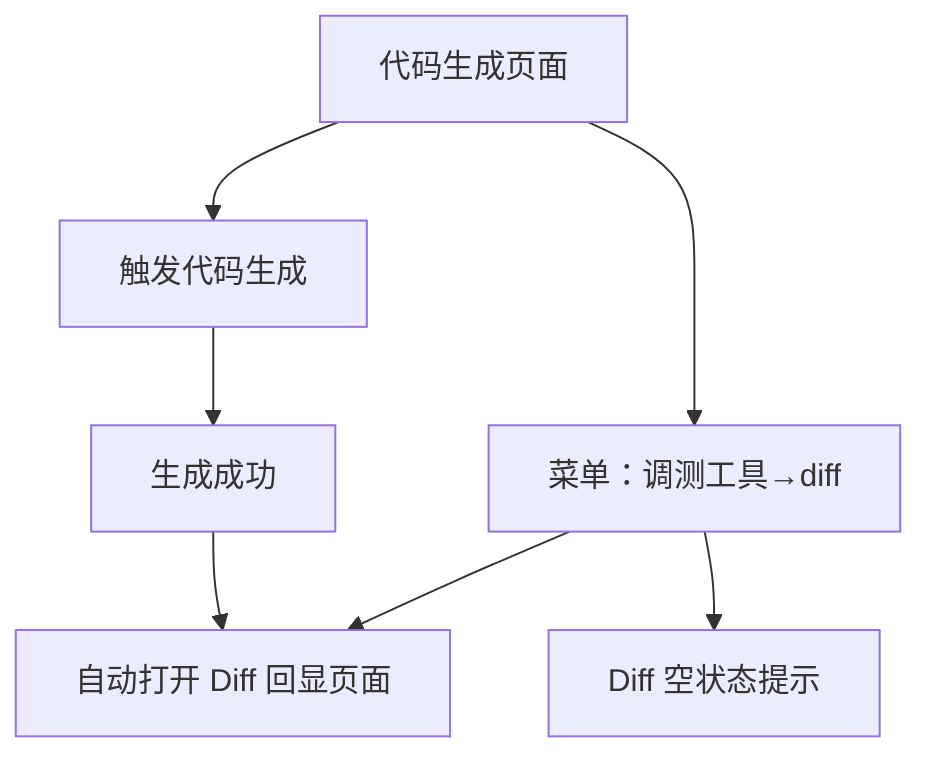

## 1. Product Overview
为现有 Web 应用新增“代码生成后自动弹出 Diff 回显子页面”，用于直观对比生成前后的代码差异。
面向需要调测/审阅代码生成结果的用户，提升可验证性与可回溯性。

## 2. Core Features

### 2.1 Feature Module
本需求由以下核心页面构成：
1. **代码生成页面**：生成后自动打开 Diff 回显；提供菜单入口可再次打开 Diff。
2. **Diff 回显页面**：左右对比旧代码/新代码；显示行号；用红/绿标识变更。

### 2.2 Page Details
| Page Name | Module Name | Feature description |
|-----------|-------------|---------------------|
| 代码生成页面 | 生成完成后自动回显 | 在代码生成成功后，自动弹出/打开 Diff 回显子页面展示本次对比结果 |
| 代码生成页面 | 菜单栏入口 | 在菜单栏“调测工具→diff”提供入口，用于重新打开 Diff 回显页面 |
| Diff 回显页面 | 左右对比布局 | 左侧展示旧代码、右侧展示新代码，固定为左右两栏对比阅读 |
| Diff 回显页面 | 行号展示 | 在两侧代码区域展示行号，便于定位差异行 |
| Diff 回显页面 | 变更标识 | 用红/绿的背景或边框标识删除/新增/修改等差异行，突出变化内容 |
| Diff 回显页面 | 空状态提示 | 当没有可回显的 Diff 内容（例如未生成过）时，提示先进行代码生成再查看 |

## 3. Core Process
- 用户在**代码生成页面**触发代码生成。
- 生成成功后，系统**自动打开 Diff 回显页面**，展示旧代码 vs 新代码的左右对比、行号与红绿变更标识。
- 用户关闭 Diff 后，如需再次查看，可通过菜单栏 **“调测工具→diff”** 重新打开 Diff 回显页面。
- 若用户直接从菜单打开但当前无可用 Diff，则展示空状态提示。

