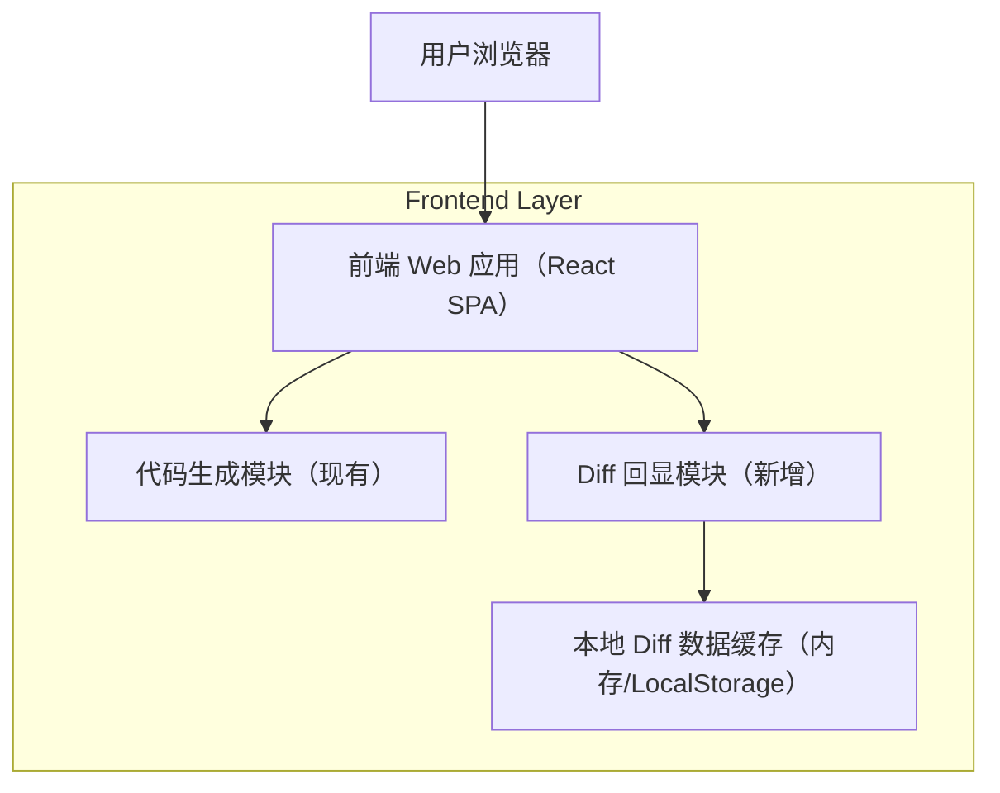

## 1.Architecture design

## 2.Technology Description
- Frontend: React@18 + TypeScript + 路由（如 react-router）
- Backend: None（本需求仅涉及前端展示与导航；代码生成能力沿用现有实现）
- UI/Editor: 选择一个支持行号与差异高亮的 Diff 组件（例如基于 Monaco Diff Editor 或等价方案）

## 3.Route definitions
| Route | Purpose |
|-------|---------|
| /generate | 代码生成页面：触发生成，并在成功后自动打开 Diff 回显 |
| /diff | Diff 回显页面：左右对比旧/新代码，展示行号与红绿变更标识；无数据时显示空状态 |

## 4.API definitions (If it includes backend services)
无（不新增后端 API）。
