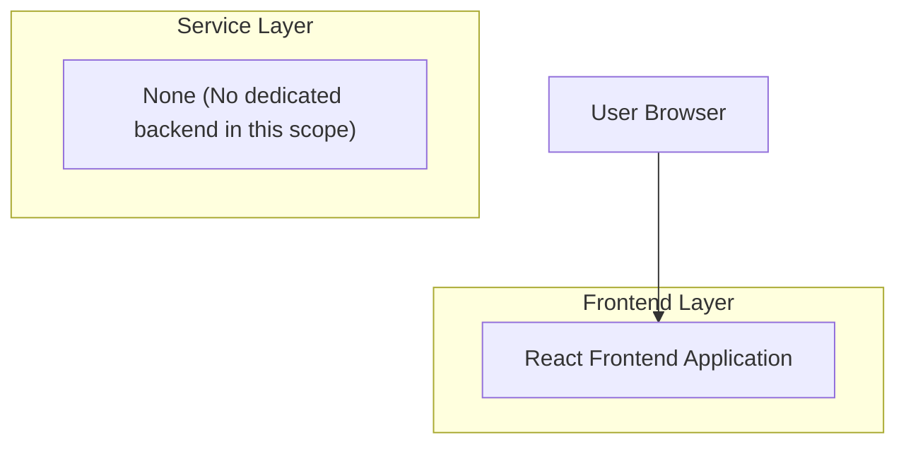

## 1.Architecture design

## 2.Technology Description
- Frontend: React@18 + TypeScript + vite
- Backend: None
- Graph/Canvas Layer: 基于 SVG/Canvas 的图编辑渲染（实现缩放、拖拽、选线、删线、布局结果渲染）

## 3.Route definitions
| Route | Purpose |
|---|---|
| /task-input | 任务输入页：模块库选择、模块详情弹窗、已选模块摘要展示 |
| /builder | 图形化搭建页：缩放/拖拽、选线/删线、自动布局与胶水隐藏 |

## 6.Data model(if applicable)
本次补充需求不强制引入后端与数据库；模块库数据来源与持久化方式沿用你们现有实现（例如前端内置配置、或已有接口）。
