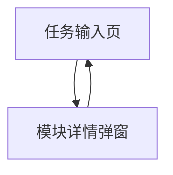

## 1. Product Overview

面向流程/任务编排场景，补齐“图形化搭建页”的关键交互能力，并完善“任务输入页”的模块库选择与详情弹窗。
目标是让你能更高效地缩放拖拽画布、选择/删除连线，并在自动布局时隐藏布局胶水元素，同时在任务输入时可选择模块并查看详情。

## 2. Core Features

### 2.1 Feature Module

本次补充需求包含以下主要页面：

1. **任务输入页**：模块库选择、模块详情弹窗、已选模块展示。
2. **图形化搭建页**：画布缩放、画布拖拽、选线、删线、布局算法触发、布局胶水隐藏。

### 2.2 Page Details

| Page Name | Module Name        | Feature description                                                          |
| --------- | ------------------ | ---------------------------------------------------------------------------- |
| 任务输入页     | 模块库入口              | 打开模块库选择区域；展示可选模块列表（最小信息：名称/摘要）。                                              |
| 任务输入页     | 模块选择               | 选择一个模块并加入“已选模块”区域；支持替换当前选择。                                                  |
| 任务输入页     | 模块详情弹窗             | 点击模块打开详情弹窗；展示模块详细信息（名称、描述、输入输出/参数说明等你们已有字段）；提供“选择/确认”动作关闭弹窗。                 |
| 任务输入页     | 已选模块摘要             | 展示当前已选模块的关键信息；提供“查看详情”再次打开弹窗。                                                |
| 图形化搭建页    | 画布基础承载             | 渲染节点与连线；提供交互命中（点击节点/点击连线/点击空白）。                                              |
| 图形化搭建页    | 缩放（Zoom）           | 通过工具条按钮或滚轮在画布中心/鼠标位置缩放；展示当前缩放比例；提供“一键复位到 100%”。                              |
| 图形化搭建页    | 拖拽（Pan）            | 鼠标按住空白区域拖拽移动画布视口；拖拽时保持节点/连线位置相对不变。                                           |
| 图形化搭建页    | 选线（Edge Selection） | 点击连线高亮选中状态；在属性区（或浮层）显示“已选连线”的基础信息（起点/终点标识）。                                  |
| 图形化搭建页    | 删线（Edge Delete）    | 对选中的连线执行删除（工具条按钮或 Del/Backspace）；删除后画布立即更新并清除选中状态；可选：对删除动作进行一次确认（若你们已有交互规范）。 |
| 图形化搭建页    | 布局算法触发             | 提供“自动布局”触发入口（按钮）；触发布局后更新节点坐标与连线路径。                                           |
| 图形化搭建页    | 布局胶水隐藏             | 对布局算法产生的“胶水/中间占位元素”（例如虚拟节点、辅助点、占位边）提供显示/隐藏开关；默认隐藏以提升画面可读性。                   |

## 3. Core Process

### 3.1 任务输入 -> 选择模块

1. 你在任务输入页打开模块库区域。
2. 你浏览模块列表，点击某个模块打开详情弹窗。
3. 你在弹窗确认选择该模块，弹窗关闭。
4. 页面“已选模块摘要”更新。
5. 你继续后续流程，进入图形化搭建页进行编排。

### 3.2 图形化搭建交互增强

1. 你进入图形化搭建页，画布展示节点与连线。
2. 你用滚轮/按钮缩放画布，用鼠标拖拽空白区域移动视口。
3. 你点击某条连线将其选中（高亮）。
4. 你点击“删除连线”或按 Del 删除选中连线。
5. 你点击“自动布局”重新排布；如开启“隐藏胶水”，布局辅助元素不展示（仅展示真实节点与业务连线）。

