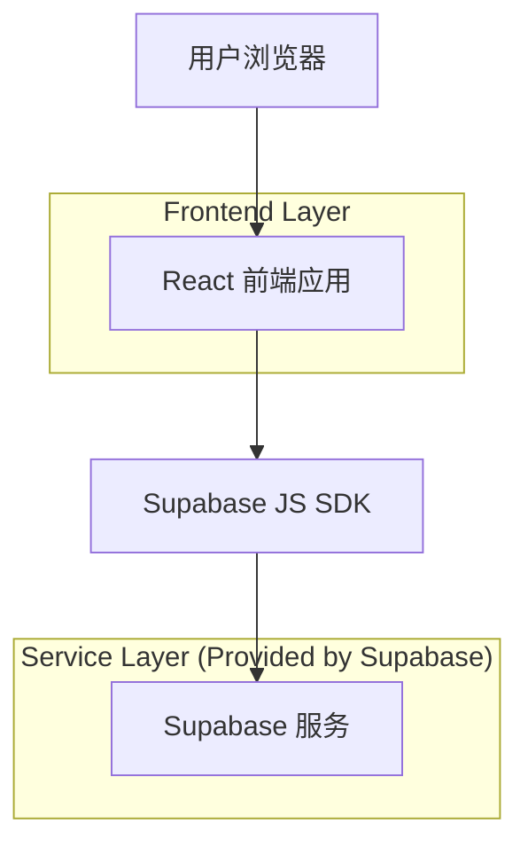

## 1.Architecture design

## 2.Technology Description
- Frontend: React@18 + TypeScript + vite + tailwindcss@3
- Frontend (diagram/editor): reactflow + @dnd-kit
- Frontend (state/validation): zustand（或同类轻量状态库）+ zod
- Backend: Supabase（本需求不涉及后端改动）

## 3.Route definitions
| Route | Purpose |
|---|---|
| /task-builder | 模块化搭建页：顶部任务 TAB、浅色投屏主题、画布与函数块可视一致性 |
| /visual-builder | 图形化输入页：顶部任务 TAB、浅色投屏主题、画布与函数块可视一致性 |

## 4.Implementation notes（前端落地要点）
### 4.1 主题与色值（建议用 CSS Variables + Tailwind 扩展）
- 设计 Token（必须满足你指定色值）：
  - --color-bg: #FFFFFF（白色主色）
  - --color-tab-border: rgb(95, 2, 107)
  - --color-canvas: rgb(252, 248, 242)
  - --color-block: rgb(227, 212, 229)
- 落地建议：
  - 在全局样式（如 :root 或 data-theme="light"）定义以上变量，页面容器统一消费变量。
  - Tailwind 通过 theme.extend.colors 映射到 CSS 变量（例如 bg-canvas、border-tab、bg-block），避免散落硬编码。

### 4.2 “任务 TAB 从左侧到顶部”结构调整
- 组件结构建议：
  - TopBar（包含：页面主导航/标题区 + 任务 TAB 条）
  - Main（包含：画布区域 +（可选）右侧属性面板/底部信息条，具体以现有实现为准）
- 交互与状态：
  - 任务 TAB 的选中状态保留原逻辑（例如 zustand store 中的 activeTaskId），仅迁移渲染位置。
  - 迁移后应保持键盘可达性：Tab 键焦点顺序从顶部开始，且选中态/焦点态在浅色主题下清晰。

### 4.3 ReactFlow 画布与节点样式适配
- 画布：
  - 将 ReactFlow 的背景容器色设置为 --color-canvas（rgb(252,248,242)）。
- 节点/函数块：
  - 节点背景使用 --color-block（rgb(227,212,229)），并为边框/阴影提供轻量层次（避免投屏时“糊成一片”）。
- 连线/选中态：
  - 选中态、悬停态、禁用态至少在“颜色 + 线宽/外描边/阴影”维度中提供 1 项差异，确保投影环境可辨。

## 5.Server architecture diagram
本需求不新增后端服务，略。

## 6.Data model(if applicable)
本需求仅涉及前端主题与布局调整，不新增/变更数据