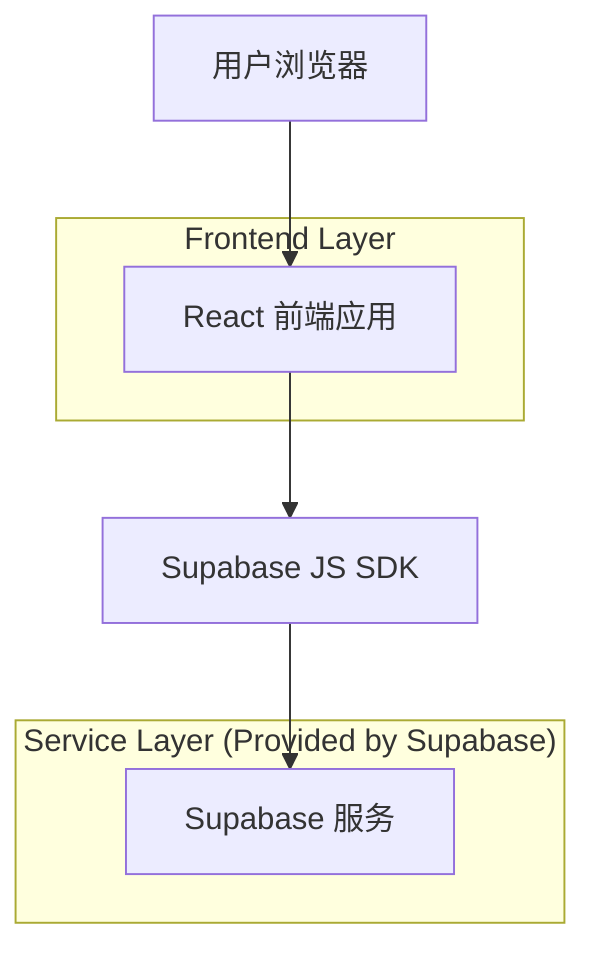
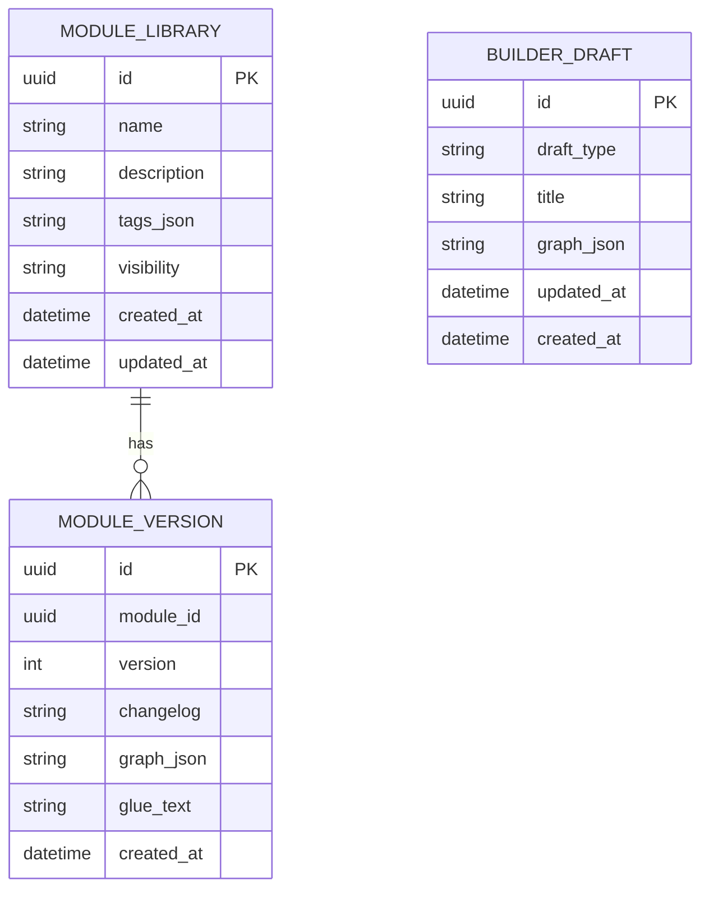

## 1.Architecture design



## 2.Technology Description

* Frontend: React\@18 + TypeScript + vite + tailwindcss\@3

* Frontend (diagram/editor): reactflow + @dnd-kit（拖拽）

* Frontend (state/validation): zustand（或同类轻量状态库）+ zod

* Backend: Supabase（Auth 可选不启用；Database + Storage）

## 3.Route definitions

| Route           | Purpose                     |
| --------------- | --------------------------- |
| /task-builder   | 模块化搭建页：加载任务分析结果、自动连线、发布与持久化 |
| /visual-builder | 图形化输入页：拖拽搭建、可选生成胶水、发布与持久化   |

## 6.Data model(if applicable)

### 6.1 Data model definition



### 6.2 Data Definition Language

Module 表（module\_library）

```sql
CREATE TABLE module_library (
  id UUID PRIMARY KEY DEFAULT gen_random_uuid(),
  name TEXT NOT NULL,
  description TEXT NOT NULL,
  tags_json TEXT NOT NULL DEFAULT '[]',
  visibility TEXT NOT NULL DEFAULT 'public',
  created_at TIMESTAMPTZ NOT NULL DEFAULT now(),
  updated_at TIMESTAMPTZ NOT NULL DEFAULT now()
);

CREATE INDEX idx_module_library_updated_at ON module_library(updated_at DESC);
CREATE INDEX idx_module_library_name ON module_library(name);
```

Module 版本表（module\_version）

```sql
CREATE TABLE module_version (
  id UUID PRIMARY KEY DEFAULT gen_random_uuid(),
  module_id UUID NOT NULL,
  version INTEGER NOT NULL,
  changelog TEXT NOT NULL,
  graph_json TEXT NOT NULL,
  glue_text TEXT,
  created_at TIMESTAMPTZ NOT NULL DEFAULT now(),
  UNIQUE(module_id, version)
);

CREATE INDEX idx_module_version_module_id ON module_version(module_id);
CREATE INDEX idx_module_version_created_at ON module_version(created_at DESC);
```

草稿表（builder\_draft）

```sql
CREATE TABLE builder_draft (
  id UUID PRIMARY KEY DEFAULT gen_random_uuid(),
  draft_type TEXT NOT NULL CHECK (draft_type IN ('task-builder', 'visual-builder')),
  title TEXT NOT NULL DEFAULT '未命名草稿',
  graph_json TEXT NOT NULL,
  updated_at TIMESTAMPTZ NOT NULL DEFAULT now(),
  created_at TIMESTAMPTZ NOT NULL DEFAULT now()
);

CREATE INDEX idx_builder_draft_updated_at ON builder_draft(updated_at DESC);
CREATE INDEX idx_builder_draft_type ON builder_draft(draft_type);
```

权限（MVP：公开读、允许匿名写草稿；生产建议开启 Auth + RLS）

```sql
-- module_library：anon 只读；authenticated 全权
GRANT SELECT ON module_library TO anon;
GRANT ALL PRIVILEGES ON module_library TO authenticated;

-- module_version：anon 只读；authenticated 全权
GRANT SELECT ON module_version TO anon;
GRANT ALL PRIVILEGES ON module_version TO authenticated;

-- builder_draft：为满足“持久化”且不引入账号，允许 anon 写入（MVP）
GRANT SELECT, INSERT, UPDATE, DELETE ON builder_draft TO anon;
GRANT ALL PRIVILEGES ON builder_draft TO authenticated;
```

