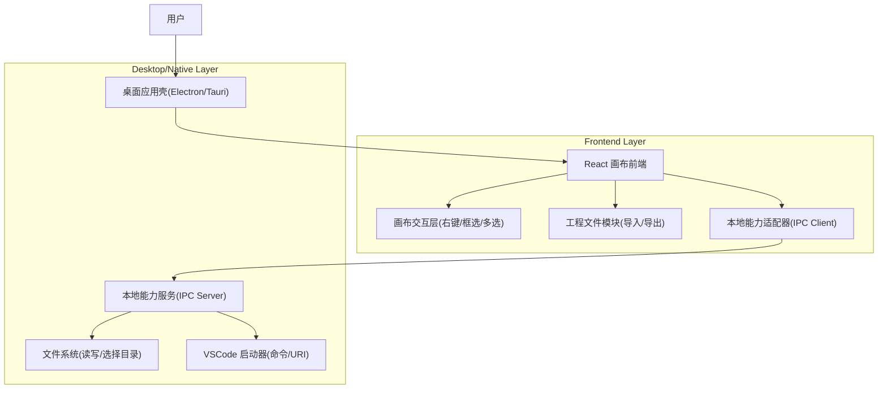

## 1.Architecture design
本需求核心是“画布交互增强 + 本地文件系统能力 + 调起本地 VSCode”。若产品为纯 Web（浏览器内运行），调起 VSCode 与稳定的本地路径管理会受安全沙箱限制；因此推荐采用桌面壳（Electron/Tauri）提供本地能力，并用 IPC 将前端事件与本地能力解耦。



## 2.Technology Description
- Frontend: React@18 + TypeScript + 现有画布渲染/编排库（保持项目既有选型）
- Desktop Shell: Electron 或 Tauri（二选一；用于文件系统访问与调起 VSCode）
- Backend: None

## 3.Route definitions
| Route | Purpose |
|-------|---------|
| /canvas | 画布编辑器主页面：右键菜单、框选多选、导入导出、VSCode 打开 |

## 4.API definitions (If it includes backend services)
本方案不引入独立后端服务；但需要定义“前端 ↔ 本地能力”的 IPC 接口（可视为本地 API）。建议用 TypeScript 共享类型，避免协议漂移。

### 4.1 IPC 类型定义（示例）
```ts
export type ProjectMeta = {
  name: string;
  version: number;
  exportedAt: string; // ISO
  appVersion?: string;
};

export type ProjectFile = {
  meta: ProjectMeta;
  graph: unknown; // 节点/连线/布局等（与现有数据结构一致）
};

export type IpcApi = {
  pickDirectory(): Promise<{ directoryPath: string } | { cancelled: true }>;
  exportProject(params: { defaultFileName: string; data: ProjectFile }): Promise<{ savedPath: string }>; 
  importProject(): Promise<{ data: ProjectFile; sourcePath?: string }>;
  openInVSCode(params: { projectPath: string }): Promise<{ ok: true } | { ok: false; reason: string }>;
};
```

## 5.Server architecture diagram (If it includes backend services)
不适用（无独立后端）。

## 6.Data model(if applicable)
本需求仅涉及“工程文件”序列化结构（非数据库）。建议使用版本号进行迁移。

### 6.1 工程文件结构（建议）
- 文件扩展名：.json 或 .autostudio
- 顶层字段：
  - meta：工程元信息（name/version/exportedAt/appVersion）
  - graph：画布图数据（保持与现有运行态数据同构或可无损映射）

### 6.2 版本迁移策略（要点）
- 导入时按 meta.version 执行 migrate(version -> latest)。
- 不认识字段保留（round-trip），避免信息丢失。
- 明确不兼容时阻止导入，并给出升级建议。

### 6.3 VSCode 打开策略（实现建议）
- 优先策略：调用系统 `code` 命令打开目录（例如：`code <projectPath>`）。
- 备选策略：使用 VSCode URL Scheme（可用时）：`vscode://file/<path>`。
- 失败处理：区分“未安装 VSCode / 未配置 code 命令 / 路径无效 / 权限不足”，将 reason 透传前端展示。
