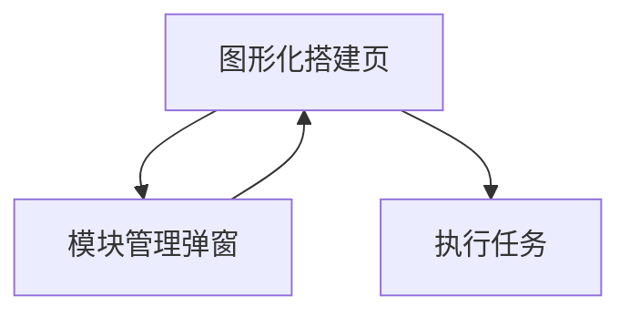

## 1. Product Overview
在需求区新增模式“自动复用代码”，支持从现有函数/模块中自动检索并复用到画布。
目标是减少重复实现成本，让你更快把任务落到可执行的模块编排上。

## 2. Core Features

### 2.1 Feature Module
本功能需求由以下核心页面构成：
1. **图形化搭建页**：需求区模式选择、模块管理弹窗、基于需求+画布的模块检索与注入、任务执行入口（按钮改名）。

### 2.2 Page Details
| Page Name | Module Name | Feature description |
|-----------|-------------|---------------------|
| 图形化搭建页 | 需求区-模式选择 | 切换“自动复用代码”模式；在该模式下提供入口打开“模块管理”弹窗。 |
| 图形化搭建页 | 模块管理弹窗-检索与推荐 | 根据“当前需求内容 + 当前画布信息”发起检索；展示最多10个可复用的函数/模块供选择；支持“重新检索”。 |
| 图形化搭建页 | 模块管理弹窗-候选项信息与状态 | 展示候选项关键字段：名称、类型（function/module）、简介、来源引用（路径/符号）、命中理由（why）；提供 loading/空状态/失败重试。 |
| 图形化搭建页 | 模块管理弹窗-选择与注入 | 支持多选（默认）选择候选模块；确认后将所选函数/模块注入到画布（以画布可识别的模块节点/引用形式落位）；若候选项已在画布存在则提示“已存在”并避免重复注入；注入后提示成功并支持“定位到新模块”（若画布支持定位）。 |
| 图形化搭建页 | 任务执行入口 | 将按钮文案“生成代码”统一改名为“执行任务”，保持原按钮位置与交互语义不变。 |

## 3. Core Process
### 3.1 主要流程
1. 你在图形化搭建页编写/调整需求内容，并切换到“自动复用代码”模式。
2. 你打开“模块管理”弹窗，系统基于“需求 + 画布当前已有模块/连线/节点信息”检索候选模块。
3. 系统返回最多10个函数/模块，你查看其名称/类型/来源/命中理由并勾选要复用的项（可重新检索）。
4. 系统将你选择的函数/模块注入画布；若检测到与画布现有模块重复，则提示并跳过重复注入。
5. 注入成功后系统给出反馈（可选：定位到新模块），便于继续编排与配置。
6. 你点击“执行任务”（原“生成代码”），进入既有的任务执行链路。

### 3.2 页面导航流程图

