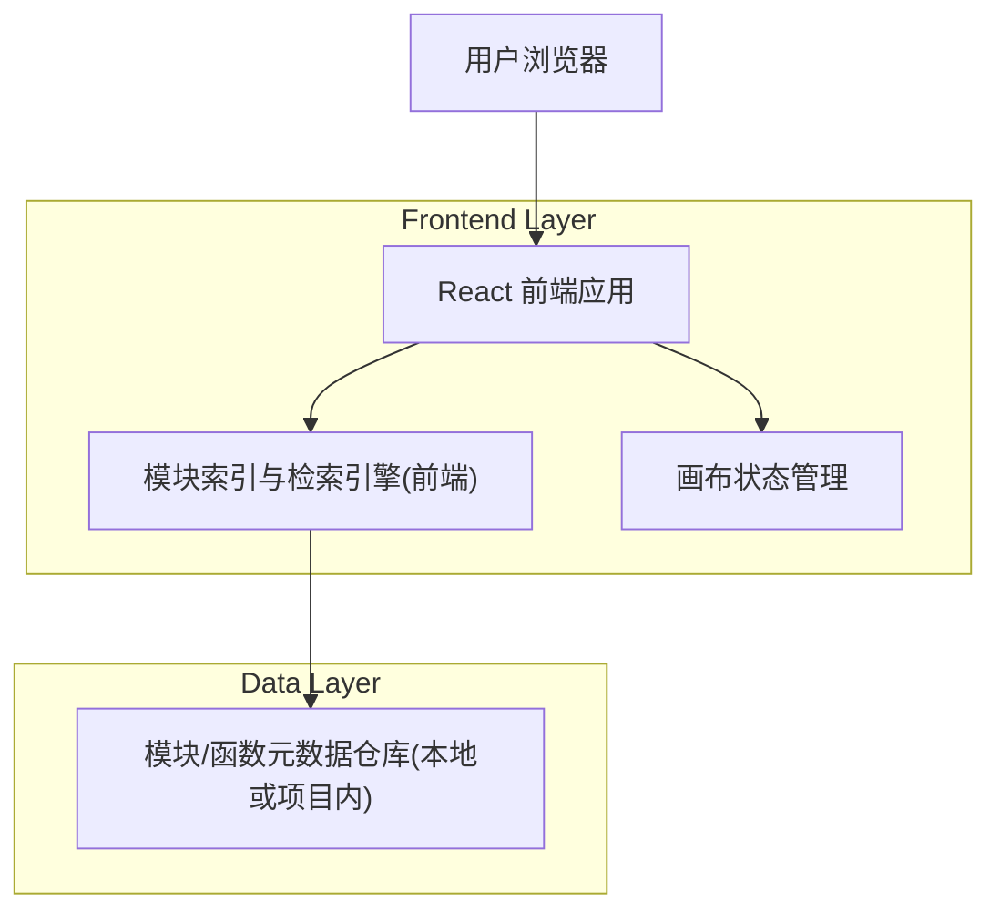

## 1.Architecture design

### 1.1 关键设计要点
- 模块索引来源：优先使用项目内可维护的“模块元数据索引”（例如 JSON/TS 常量），避免运行时全量扫描代码导致性能不稳定。
- 检索输入：`需求文本 + 画布摘要(已有节点/模块/连线)` 组合成查询，提高复用准确率并减少重复推荐。
- 去重策略：在返回候选与注入画布时均需检查“是否已存在同源模块/同 ID 模块”，避免重复节点。
- Top-K：候选项只返回/展示 Top 10，确保交互简洁可控。

## 2.Technology Description
- Frontend: React@18 + TypeScript +（现有项目的 UI 组件库/样式方案）
- Backend: None

## 3.Route definitions
| Route | Purpose |
|-------|---------|
| /builder | 图形化搭建页：需求区、画布、模块管理弹窗、执行任务入口 |

## 4.API definitions (If it includes backend services)
无（本功能在前端完成检索与注入）。

## 6.Data model(if applicable)
### 6.1 Data model definition
（建议以“模块元数据 + 画布可注入表示”建模；不强制引入数据库）

- ModuleMeta
  - id: string
  - name: string
  - type: 'function' | 'module'
  - description: string
  - tags: string[]
  - signature?: string
  - inputs?: Array<{ name: string; type: string }>
  - outputs?: Array<{ name: string; type: string }>
  - dependencies?: string[]
  - exports?: string[]
  - sourceRef: { path: string; symbol?: string }
  - hash?: string  (用于变更检测/去重)

- ReuseSearchQuery
  - requirementText: string
  - canvasDigest: { nodeSummaries: string[]; edgeSummaries: string[] }

- ReuseSearchResult
  - items: Array<{ module: ModuleMeta; score: number; reason: string }>
  - limitedTo: 10

- CanvasInjectionPayload
  - modules: ModuleMeta[]
  - placement: 'auto' | 'cursor'
  - injectionMode: 'reference' | 'copy'

### 6.2 Data Definition Language
无（不引入数据库时不提供 DDL）。
