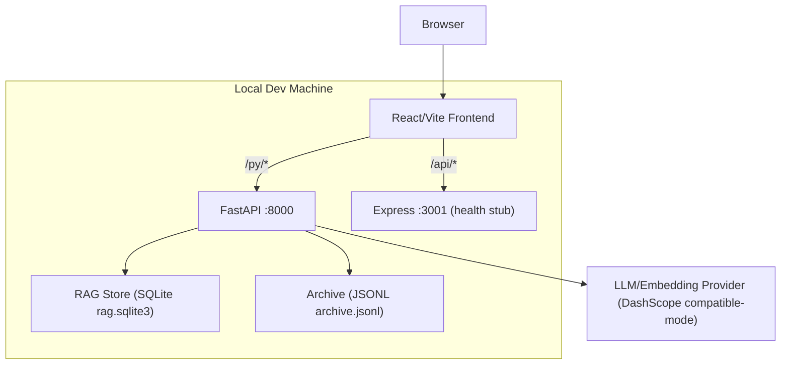

# AI-CBDES-Rule Technical Architecture

本文档以当前仓库的“可运行实现”为准，描述前端、FastAPI 后端、RAG 本地持久化与 LLM 调用策略，并给出清晰的目录结构索引。

## 1. Tech Stack

### 1.1 Frontend

* React 18 + TypeScript

* Vite（开发/构建）

* Tailwind CSS（样式）

* Ant Design（主要 UI 组件库）

* React Router（页面路由）

* Zustand（全局状态：任务草稿等）

### 1.2 Backend

### 1.2.1 Python FastAPI（主后端）

* FastAPI + Uvicorn

* 能力：RAG 扫描/索引/检索、函数详情/编辑、测试执行、档案管理、任务问题分析、代码生成（占位）

### 1.2.2 Node/Express（辅助占位）

* Express（仅提供 `/api/health` 健康检查；便于未来扩展 Node 侧能力）

### 1.3 Storage

* **RAG 索引库**：本地 SQLite（`rag.sqlite3`），表 `functions` 存储函数切片、display\_name、module、`doc_zh/doc_en`、embedding(BLOB)+维度等

* **档案库**：本地 JSONL（`archive.jsonl`），追加写入事件流（例如 `rag.query`、`workflow.saved`）

### 1.4 AI/LLM

* 通过 `openai` Python SDK 调用阿里云百炼 OpenAI 兼容接口（DashScope compatible-mode）

* 统一的限流与重试：全局并发控制 + 每分钟请求数控制 + 429/5xx 退避重试（支持 `Retry-After`）

## 2. System Architecture



说明：

* 前端开发时通过 Vite `proxy` 访问后端：`/py/*` 代理到 FastAPI；`/api/*` 代理到 Express。

* 当前仓库的 RAG 扫描/索引依赖“读取本机代码目录”，因此默认以本地运行模式为主。

## 3. Key Flows

### 3.1 RAG 索引（Index）

* 扫描目录：解析 `cpp/h/python` 等文件并按函数切分

* 索引增强（强制开启）：LLM 生成 `display_name`、`module`、`doc_zh`、`doc_en`

* 向量化：对检索文本（含中英文描述+代码）做 embedding

* 落库：写入 SQLite `functions` 表

### 3.2 检索（Query）

* 对 query 生成 embedding

* 在本地 SQLite 中对已存 embedding 计算相似度并返回 TopK

### 3.3 缺失描述补全（Backfill Docs）

* 针对库中 `doc_zh/doc_en` 为空的函数，后台异步任务批量补全并重置向量

### 3.4 在线代码生产线：图形化搭建

* 左侧按模块加载函数库，拖拽到画布形成 workflow

* 保存到本地（localStorage）并可写入档案事件（Archive）

### 3.5 任务输入：问题分析 + RAG 关联

* 前端提交结构化工单到 `/task/analyze`

* LLM 输出分析（Markdown）并建议检索 query

* 后端用 query 触发 RAG 检索并返回关联函数集合

## 4. Directory Structure

```
AI-CBDES-Rule/
├── api/
│   └── index.ts                 # Express 健康检查占位
├── backend/
│   ├── requirements.txt         # FastAPI 依赖
│   └── app/
│       ├── main.py              # FastAPI 入口
│       ├── schemas.py           # Pydantic Schemas
│       ├── routers/
│       │   ├── rag.py           # /rag
│       │   ├── archive.py       # /archive
│       │   ├── codegen.py       # /codegen
│       │   └── task.py          # /task
│       └── services/
│           ├── rag_service.py
│           ├── rag_store.py
│           ├── rag_enricher.py
│           ├── rag_embedder.py
│           ├── llm_policy.py
│           ├── archive_service.py
│           └── task_analysis_service.py
├── src/
│   ├── components/
│   │   ├── layout/
│   │   └── rag/
│   ├── pages/
│   │   ├── offline/             # RAG/档案/SFT
│   │   └── online/              # 图形化搭建/任务输入/编排/测试/发布
│   ├── store/
│   └── utils/
├── data/                        # 示例代码库（可索引）
└── .trae/documents/             # PRD/架构/页面设计
```

## 5. Deployment Notes

* 前端可部署到静态站点（例如 Vercel）；但 RAG 索引依赖本地文件系统，完整在线化需要额外的云端后端与代码仓库存储方案。

