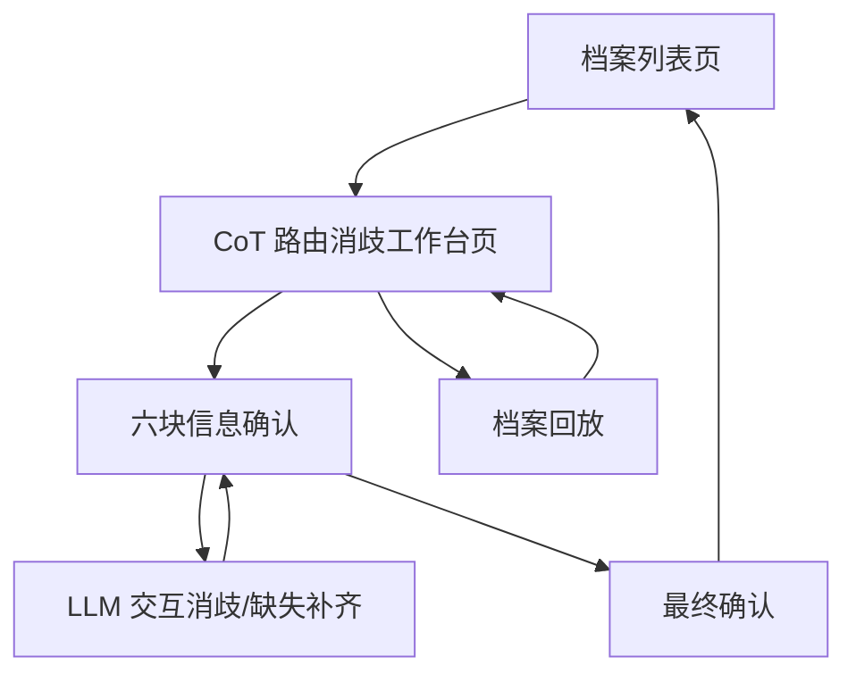

## 1. Product Overview
面向“CoT 路由消歧”的工作台式页面改造：把输入档案拆成 6 块信息逐块加载与确认，并在最终确认后一键产出可落地的“消歧结果”。
支持档案回放（按时间线重放/定位），并通过 LLM 交互完成“消歧 + 缺失补齐”，全过程留痕可追溯。

## 2. Core Features

### 2.1 Feature Module
本产品（页面）由以下最小集合构成：
1. **档案列表页**：档案检索/筛选、进入消歧工作台、查看状态。
2. **CoT 路由消歧工作台页**：档案加载与回放、六块信息逐块确认、LLM 交互消歧与缺失补齐、最终确认与结果落库。

### 2.3 Page Details
| Page Name | Module Name | Feature description |
|-----------|-------------|---------------------|
| 档案列表页 | 档案检索与筛选 | 按档案编号/时间/状态搜索；展示列表与关键字段（来源、创建时间、当前进度）。 |
| 档案列表页 | 状态与进入入口 | 展示“未开始/进行中/已完成/异常”状态；点击进入对应档案的消歧工作台。 |
| CoT 路由消歧工作台页 | 档案加载 | 拉取档案原始信息；初始化 6 块信息的默认值与缺失项清单；展示加载/失败重试。 |
| CoT 路由消歧工作台页 | 六块信息确认（Block 1-6） | 按预定义顺序逐块展示；每块包含：字段值、来源片段引用、缺失/冲突提示、确认/编辑；支持“未确认/已确认/需LLM协助”状态。 |
| CoT 路由消歧工作台页 | LLM 交互消歧 | 在块级或字段级发起对话：提出澄清问题/给出候选值与依据；用户可“采纳/改写/驳回”；将最终选择回写到对应字段并记录理由。 |
| CoT 路由消歧工作台页 | 缺失补齐 | 对必填字段缺失时：自动生成补齐建议（可多候选）；要求用户显式确认后写入；对无法补齐项标记为阻塞。 |
| CoT 路由消歧工作台页 | 最终确认 | 聚合 6 块确认结果与校验（必填、格式、一致性）；提供“差异摘要/风险提示”；用户一键最终确认生成“消歧结果版本”。 |
| CoT 路由消歧工作台页 | 档案回放 | 以时间线/事件流展示档案关键步骤；支持播放/暂停/步进/跳转；点击事件可定位到对应信息块与证据片段。 |
| CoT 路由消歧工作台页 | 留痕与版本 | 记录每次字段变更、LLM 建议与用户决策；支持查看本次与上次结果的对比摘要（只读）。 |

## 3. Core Process
### 3.1 消歧工作流
1) 你从“档案列表页”选择一个档案进入工作台。
2) 系统加载档案并初始化 6 块信息：对缺失/冲突字段打标。
3) 你按顺序逐块确认：能直接确认的字段直接勾选；需要修改的字段手动编辑并保存。
4) 遇到“冲突/不确定/缺失”时，你在该块发起 LLM 交互：
- 系统给出澄清问题或候选值（附依据片段/引用）。
- 你采纳/改写/驳回，并将结论回写到字段；系统记录理由。
5) 六块全部达到“可通过”状态后，你进入“最终确认”：
- 系统展示差异摘要、阻塞项、风险提示。
- 你确认后生成“消歧结果（版本化）”并保存。

### 3.2 档案回放流
1) 你在工作台打开“回放”面板。
2) 你按时间线播放/步进；点击事件会高亮对应信息块并滚动定位。
3) 你可在回放中查看当时的字段值、引用证据、LLM 往返记录（只读）。

