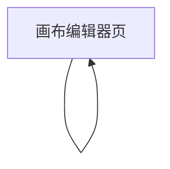

## 1. Product Overview
面向“图形化搭建画布”的编辑器：你可以拖拽节点到画布、用正交圆角连线连接节点，并在右侧面板查看全图输入/输出汇总结果。
核心价值：用可视化方式快速搭建与校验数据/流程的输入输出关系，并一键导出汇总结果。

## 2. Core Features

### 2.1 Feature Module
本产品的最小可用需求由以下页面组成：
1. **画布编辑器页**：节点拖拽与布局、正交圆角连线、全图IO汇总右侧面板。

### 2.2 Page Details
| Page Name | Module Name | Feature description |
|-----------|-------------|---------------------|
| 画布编辑器页 | 顶部工具栏 | 切换选择/连线模式；执行撤销/重做；适配缩放/自适应视图；清空画布（需二次确认）。 |
| 画布编辑器页 | 节点库（可拖拽） | 展示可用节点列表；拖拽节点到画布创建实例；创建后自动对齐到栅格/吸附策略（可开关）。 |
| 画布编辑器页 | 节点交互 | 选择节点/多选；拖拽移动；删除；显示节点名称与输入/输出端口（Port）。 |
| 画布编辑器页 | 连线交互（正交圆角） | 从输出端口拖到输入端口创建连线；连线采用正交路径并圆角过渡；拖动节点时连线自动重算；选中连线并删除；禁止不合法连接（如输入-输入、输出-输出、同端口重复连接）。 |
| 画布编辑器页 | 右侧面板：全图IO汇总输出 | 基于当前全图实时计算并展示：\n- 全局输入集合（未被任何上游输出满足的输入端口/字段）\n- 全局输出集合（未被任何下游消耗的输出端口/字段）\n- 连接关系摘要（可折叠列表）\n支持复制为JSON/文本。 |
| 画布编辑器页 | 校验与提示 | 在右侧面板/画布内提示：悬空输入、悬空输出、断开连接；在创建连线时即时提示原因。 |

## 3. Core Process
你的主要操作流程：
1) 打开画布编辑器页，在左侧节点库中拖拽需要的节点到画布中。
2) 调整节点位置，使用连线交互从“输出端口”拖到“输入端口”完成连接；连线以正交圆角形式展示，并在节点移动时自动保持合理走线。
3) 在右侧面板查看系统基于“全图”计算的输入/输出汇总：你能快速看到哪些输入仍未被满足、哪些输出未被使用，并可复制汇总结果用于后续处理。

