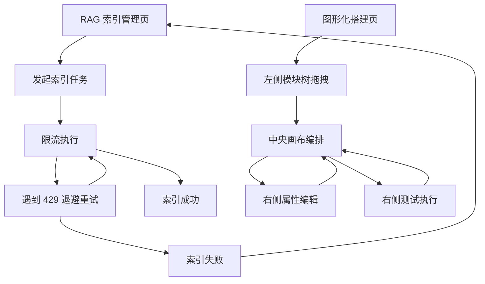

## 1. Product Overview
为 AI-CBDES-Rule 增补两项关键能力：RAG 索引过程的限流与 429 重试退避，以及在线代码生产线的“图形化搭建”拖拽画布页。
它提升索引稳定性与可视化编排效率，降低工程师在大规模代码库上的迭代成本。

## 2. Core Features

### 2.1 User Roles
| 角色 | 注册方式 | 核心权限 |
|------|----------|----------|
| 工程师/维护人员 | 使用现有系统账号登录 | 发起/查看 RAG 索引任务、查看索引结果与错误；在图形化画布中拖拽搭建流程、编辑属性并执行测试 |

### 2.2 Feature Module
本次需求仅新增/增强以下页面：
1. **RAG 索引管理页**：索引任务发起、进度与结果、限流保护与 429 重试可观测。
2. **图形化搭建页**：左模块树拖拽、中央画布编排、右侧属性与测试。

### 2.3 Page Details
| Page Name | Module Name | Feature description |
|-----------|-------------|---------------------|
| RAG 索引管理页 | 索引任务控制 | 发起“扫描并索引”；展示任务状态（排队/运行中/成功/失败）、进度（已处理/总数）与耗时。 |
| RAG 索引管理页 | 限流与重试可观测 | 显示当前索引的并发/节流状态（例如“并发 2/2”）；当遇到 429 时显示重试次数、下一次重试倒计时与最终失败原因。 |
| RAG 索引管理页 | 失败处理 | 支持对失败任务执行“重试”（重建任务或从失败点继续，取决于现有实现）；展示最近一次错误摘要。 |
| 图形化搭建页 | 左侧模块树（可拖拽） | 按模块分组展示可用构件/函数；支持搜索；支持将条目拖拽到画布生成节点。 |
| 图形化搭建页 | 中央画布（编排） | 支持节点放置、移动、连线；支持缩放/平移；支持删除节点/连线；支持保存当前画布为草稿。 |
| 图形化搭建页 | 右侧属性面板 | 选中节点/连线后展示可编辑属性（名称、输入/输出映射、关键参数）；修改后即时反映到画布节点展示。 |
| 图形化搭建页 | 右侧测试面板 | 支持对当前选中节点或整个画布执行一次测试；展示运行状态、结果摘要与日志/错误信息。 |

## 3. Core Process
**RAG 索引流程**
1) 你在「RAG 索引管理页」发起扫描并索引。
2) 系统将索引任务进入队列并按并发上限执行；对上游模型/Embedding 调用做限流。
3) 若遇到 429：系统按退避策略自动重试，并在页面显示重试倒计时与次数。
4) 任务成功后更新索引统计；失败则保留错误摘要并允许重试。

**图形化搭建流程**
1) 你进入「图形化搭建页」，从左侧模块树拖拽构件到中央画布。
2) 你在画布中连线形成流程，并在右侧属性面板配置参数与映射。
3) 你在右侧测试面板执行测试并查看结果；必要时继续调整与再次测试。

