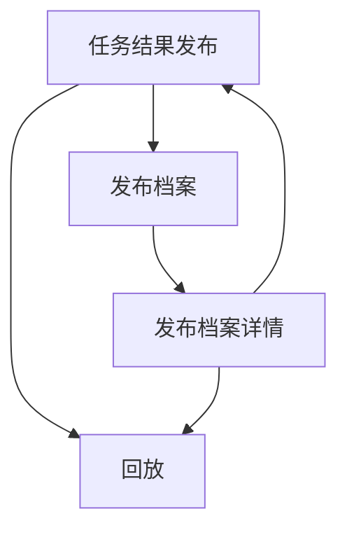

## 1. Product Overview
“任务结果发布”用于将已通过门禁的任务生成结果正式发布为可追溯版本，并支持将结果同步入库（RAG 索引与模块库）后进行回放验证。
页面同时沉淀每次发布操作的档案，支持从档案一键跳转并加载当次发布快照。

## 2. Core Features

### 2.1 Feature Module
本需求由以下核心页面组成：
1. **任务结果发布**：门禁通过校验、版本号生成、RAG 索引入库、模块入库、回放验证、发布确认与落档。
2. **发布档案**：发布档案列表检索、查看摘要、跳转加载到发布页。
3. **回放**：按发布快照加载结果与依赖、执行/查看回放、输出对比与结论。

### 2.2 Page Details
| Page Name | Module Name | Feature description |
|-----------|-------------|---------------------|
| 任务结果发布 | 门禁状态与结果选择 | 显示任务基本信息、门禁通过状态与原因；选择一个“已通过门禁”的生成结果作为发布源（仅允许通过态）。 |
| 任务结果发布 | 版本号生成 | 基于“门禁通过的生成结果”生成版本号并展示；支持在发布前预生成/刷新；发布后版本号不可变更。 |
| 任务结果发布 | 入库配置（RAG 索引） | 选择/新建目标索引；配置本次索引范围（如：仅本结果、包含依赖文档/模块）；发起入库并展示进度与结果（成功/失败/跳过）。 |
| 任务结果发布 | 入库配置（模块库） | 选择模块分类/命名空间；写入/更新模块条目（以本次生成结果为源）；展示写入摘要与冲突提示（如同名覆盖/新建）。 |
| 任务结果发布 | 回放验证 | 以“本次发布快照”触发回放；展示回放参数、执行状态、关键日志与结果结论；支持将回放结果一并记录到发布档案。 |
| 任务结果发布 | 发布确认与落档 | 在入库完成（或明确选择跳过）后执行发布；将发布操作、版本号、入库结果、回放结果、操作者与时间写入档案；返回可复制的档案链接。 |
| 发布档案 | 档案列表 | 按任务/版本号/时间/操作者筛选与排序；展示每条档案的状态（成功/部分成功/失败）、摘要与关联版本号。 |
| 发布档案 | 档案详情与跳转加载 | 查看档案全量信息（版本号、入库明细、回放结论、错误）；一键“加载到发布页”以复现当次配置与快照。 |
| 回放 | 快照加载 | 从档案/发布页接收快照 ID 并加载对应发布源、索引与模块依赖；校验所需资源可用性。 |
| 回放 | 执行与对比 | 执行回放并展示输出；支持与档案内基线/期望结论对比（如：一致/不一致）；输出回放结论与可下载日志。 |

## 3. Core Process
你在“任务结果发布”中选择一个已通过门禁的生成结果作为发布源。系统据此生成版本号，并引导你完成两类入库：将内容写入 RAG 索引、将结构化产物写入模块库。入库完成后，你可以基于“本次发布快照”发起回放验证以确认可复现性与关键输出。最后执行发布，系统将版本号、入库明细、回放结论与操作者信息统一写入发布档案。之后你可以在“发布档案”中检索历史发布，并从某条档案跳转回“任务结果发布”，自动加载当次发布快照用于复查或再发布。

