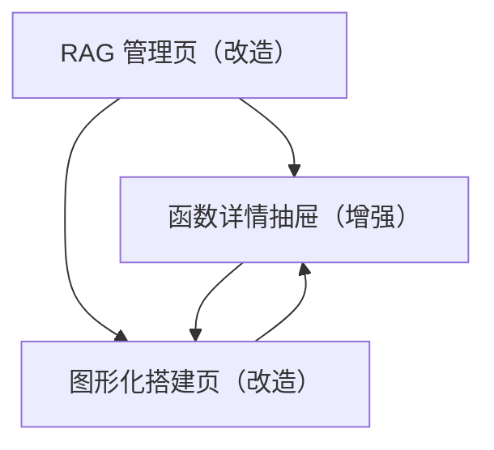

## 1. Product Overview
在现有“RAG 管理 + 图形化搭建”基础上，引入“函数三类分类”与“模块索引/维护”，让函数库更可控、更可筛选、更适合拖拽编排。
重点交付：数据模型升级、模块发现规则统一、两页面关键交互重构。

## 2. Core Features

### 2.1 User Roles
| 角色 | 注册方式 | 核心权限 |
|------|----------|----------|
| 研发/维护人员 | 使用现有系统访问方式 | 维护模块索引与发现规则、触发索引/补全、管理函数元数据（模块/分类）、在图形化搭建页拖拽编排与测试 |

### 2.2 Feature Module
本需求的最小可用页面如下：
1. **RAG 管理页（改造）**：模块索引维护、模块发现规则预览、函数三类分类与筛选、函数详情（源码/描述/元数据）维护。
2. **图形化搭建页（改造）**：基于“模块 + 三类分类”浏览/搜索函数，拖拽生成节点并配置参数与测试。

### 2.3 Page Details
| Page Name | Module Name | Feature description |
|-----------|-------------|---------------------|
| RAG 管理页（改造） | 模块索引维护 | 维护模块清单（新增/编辑/停用）；配置模块发现规则（路径匹配规则、优先级、是否允许 LLM 纠偏）；展示规则命中预览（给定文件路径→命中模块）。 |
| RAG 管理页（改造） | 函数三类分类 | 将函数归入三类并在列表中展示标签：①可编排函数（默认用于画布节点）；②领域算法函数；③工具/基础设施函数；支持手动改分类并记录来源（manual/rule/llm/heuristic）。 |
| RAG 管理页（改造） | 函数库浏览与筛选 | 按模块/分类/关键字筛选函数；列表展示：模块、分类、名称、签名、文件路径、向量状态；支持批量操作（删除/批量改模块或分类，若系统已有批量框架则复用）。 |
| RAG 管理页（改造） | 函数详情抽屉（增强） | 查看源码/描述/输入输出；编辑并保存源码；编辑函数元数据（模块、分类、展示名、描述）；保存后可选择“仅更新元数据/同时重向量化”。 |
| RAG 管理页（改造） | 索引与补全任务 | 触发扫描/索引/补全描述任务；任务进度可轮询展示；索引完成后自动刷新函数库与模块统计。 |
| 图形化搭建页（改造） | 函数选择器（左栏） | 以“模块→分类→函数”分组展示；默认只显示“可编排函数”，可开关显示其余两类；搜索同时命中函数名/路径/签名/描述摘要。 |
| 图形化搭建页（改造） | 节点拖拽与连线 | 拖拽函数生成节点；节点保留函数的 module + category；连线时根据输入/输出元信息做最小校验（无结构则允许但提示“未声明 IO”）。 |
| 图形化搭建页（改造） | 属性与测试面板 | 选中节点后编辑参数/输入输出映射/测试命令；支持一键测试当前节点；测试结果回显并同步节点状态角标。 |

## 3. Core Process
**维护人员（模块与函数库维护）**
1) 在 RAG 管理页维护“模块索引”：新增/调整模块与路径规则，并用“路径→模块预览”验证。
2) 触发索引任务：系统扫描并入库函数；按“模块发现规则”确定 module；按“分类规则”确定 category。
3) 在函数库中按模块/分类筛选；打开函数详情抽屉，必要时手动修正 module/category/描述并保存。

**编排人员（图形化搭建）**
1) 进入图形化搭建页，默认在左侧仅浏览“可编排函数”。
2) 通过模块/分类/搜索定位函数，拖入画布生成节点并连线。
3) 在右侧配置节点参数与测试命令，运行测试并根据结果迭代。

