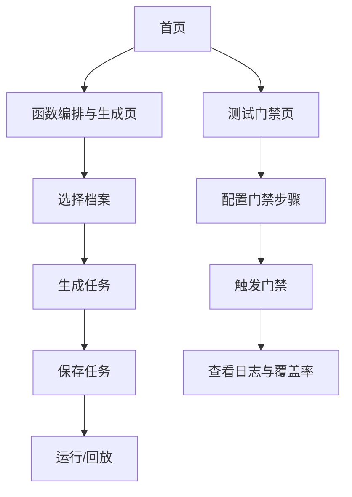

## 1. Product Overview
面向研发团队的两大核心工作台：从“档案（代码/配置包）”快速生成可回放的函数编排任务；并以“测试门禁”方式对任务/代码进行编译、静态检查、单测与覆盖率验证，集中展示日志。
目标是降低任务生成与验证成本，让问题定位与回归更可追溯。

## 2. Core Features

### 2.1 Feature Module
本产品的最小可用页面如下：
1. **首页**：入口导航、最近任务/最近门禁运行概览。
2. **函数编排与生成页**：档案选择、任务生成、持久化、运行记录与回放。
3. **测试门禁页**：门禁配置与触发、编译/静态/单测/覆盖率执行与日志展示。

### 2.2 Page Details
| Page Name | Module Name | Feature description |
|-----------|-------------|---------------------|
| 首页 | 入口导航 | 跳转到“函数编排与生成页”“测试门禁页”。 |
| 首页 | 最近概览 | 查看最近生成的任务与最近一次门禁运行的状态（成功/失败/进行中）。 |
| 函数编排与生成页 | 档案选择 | 选择一个档案作为任务生成输入；展示档案基础信息（名称、更新时间）。 |
| 函数编排与生成页 | 任务生成 | 基于所选档案生成任务（包含函数列表与执行顺序/编排关系）；生成后提供任务摘要与可导出的任务定义（JSON/YAML 二选一即可）。 |
| 函数编排与生成页 | 持久化 | 保存任务定义与版本信息；支持再次打开并继续使用。 |
| 函数编排与生成页 | 运行与回放 | 触发一次任务运行并记录时间线；支持查看历史运行并按时间线回放步骤与输出日志。 |
| 测试门禁页 | 门禁配置 | 选择待验证对象（任务/档案版本）；配置要执行的步骤：编译、静态检查、单元测试、覆盖率。 |
| 测试门禁页 | 门禁执行 | 一键触发门禁；按步骤显示进行中/成功/失败；失败时停止后续步骤（除非已明确配置为继续）。 |
| 测试门禁页 | 日志与报告 | 分步骤展示日志；展示覆盖率汇总（总体百分比与关键指标）；支持下载完整日志。 |

## 3. Core Process

### 3.1 函数编排与生成流
1) 你在“函数编排与生成页”选择一个档案。
2) 系统基于档案生成一份任务定义（包含函数与编排关系）。
3) 你保存任务定义（形成可追溯版本）。
4) 你触发一次运行；系统记录每个步骤的开始/结束时间与输出。
5) 你从历史列表选择某次运行进行回放，按时间线复现步骤状态与日志。

### 3.2 测试门禁流
1) 你在“测试门禁页”选择要验证的对象（任务/档案版本）。
2) 你勾选门禁步骤：编译 → 静态检查 → 单元测试 → 覆盖率。
3) 你触发门禁；系统按顺序执行并实时更新状态。
4) 你查看分步骤日志与覆盖率汇总；必要时下载完整日志用于分享/归档。

