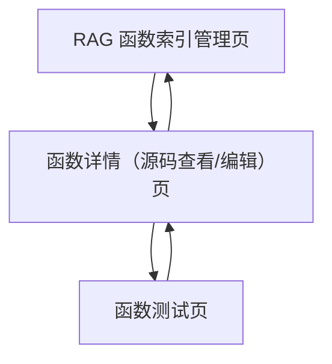

## 1. Product Overview
面向开发与维护人员的「RAG 函数索引管理」增强页，用于快速掌握已索引函数规模、按模块筛选定位，并直接查看/修改函数源码与进入测试入口。
它减少“找函数—看源码—改代码—跑测试”的来回切换成本，提高索引质量与迭代效率。

## 2. Core Features

### 2.1 User Roles
| 角色 | 注册方式 | 核心权限 |
|------|----------|----------|
| 维护人员（开发/算法/平台） | 使用现有系统账号登录 | 浏览函数索引列表、按模块筛选、查看函数源码、修改函数源码、进入测试入口 |

### 2.2 Feature Module
我们的 RAG 管理增强需求由以下页面组成：
1. **RAG 函数索引管理页**：已索引函数总数与列表、按模块分组与筛选、快速定位与查看源码入口。
2. **函数详情（源码查看/编辑）页**：函数元信息、源码查看、高亮与定位、源码修改与保存。
3. **函数测试页**：从函数详情进入测试入口、配置测试参数与执行、查看测试结果与日志摘要。

### 2.3 Page Details
| Page Name | Module Name | Feature description |
|-----------|-------------|---------------------|
| RAG 函数索引管理页 | 统计摘要 | 显示“已索引函数总数”，并展示最后一次索引更新时间（如系统已有该信息则直接复用）。 |
| RAG 函数索引管理页 | 列表与分组 | 按“模块”分组展示函数列表；每个模块显示模块名与函数数量；支持展开/收起模块分组。 |
| RAG 函数索引管理页 | 筛选与搜索 | 按模块筛选（单选/多选取决于现有交互约束，默认单选）；支持关键字搜索以快速定位函数（函数名/文件路径/签名任一命中即可）。 |
| RAG 函数索引管理页 | 快速定位 | 在列表中提供“查看源码”入口，点击后进入函数详情页并直接定位到函数定义位置。 |
| 函数详情（源码查看/编辑）页 | 函数元信息 | 展示函数名、所属模块、文件路径、签名/参数（若已有）、索引状态（若已有）、最后更新时间（若已有）。 |
| 函数详情（源码查看/编辑）页 | 源码查看 | 显示函数源码并支持行号；默认只读；提供“复制源码/复制路径”快捷操作。 |
| 函数详情（源码查看/编辑）页 | 源码编辑与保存 | 提供“进入编辑”切换；编辑态支持撤销到最近一次保存版本；保存后提示成功/失败并回到只读态（或保持编辑态，按系统习惯）。 |
| 函数详情（源码查看/编辑）页 | 测试入口 | 提供“去测试”入口，将当前函数作为测试对象带入函数测试页。 |
| 函数测试页 | 测试配置 | 提供最小可用的测试输入区：可填写测试用例/输入参数（以文本/JSON 形式），并选择运行方式（如系统已有固定方式则仅展示说明）。 |
| 函数测试页 | 执行与结果 | 点击执行后展示运行状态；输出测试结果摘要（成功/失败、耗时）；可查看日志/错误堆栈（若系统有）。 |

## 3. Core Process
**维护人员流程**
1) 进入「RAG 函数索引管理页」，先查看已索引函数总数与模块分布。
2) 通过模块筛选与关键字搜索，快速定位到目标函数。
3) 点击“查看源码”，进入「函数详情」并直接看到带行号的函数源码。
4) 如需修改：切换到编辑态，完成修改后保存；保存成功后可继续查看或前往测试。
5) 点击“去测试”，进入「函数测试页」，填写最小测试输入并执行，查看结果与日志摘要。

