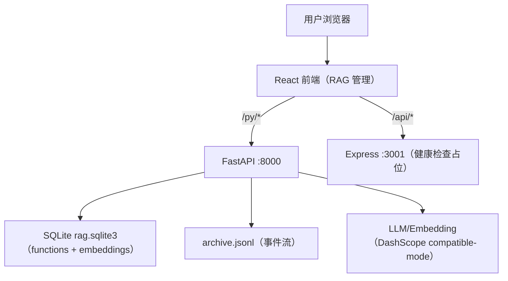

## 1. Architecture Design

关键说明：
- “查看源码/定位行号/编辑保存/触发测试执行/索引任务”都需要后端安全访问本机目录与执行环境，因此统一由 FastAPI 暴露最小能力集。
- 当前实现不依赖 Supabase/PostgreSQL：RAG 索引落在本地 SQLite；档案事件落在本地 JSONL。

## 2. Technology Description
- Frontend: React@18 + TypeScript + Vite + TailwindCSS + Ant Design + Zustand
- Backend:
  - FastAPI + Uvicorn（RAG/档案/任务分析/代码生成占位）
  - Express（仅 `/api/health` 占位）
- Storage:
  - SQLite（RAG）
  - JSONL（Archive 事件）

## 3. Route Definitions

### 3.1 Frontend
| Route | Purpose |
|-------|---------|
| `/offline/rag` | RAG 管理：扫描/索引/检索/函数详情抽屉/补全描述 |
| `/offline/archive` | 档案管理：查看 Archive 事件流 |
| `/online/graph-builder` | 图形化搭建：从函数库拖拽搭建 workflow、保存与写入档案 |
| `/online/task` | 任务输入：选择函数/模块、填写工单、问题分析与 RAG 关联 |

### 3.2 Backend (FastAPI)
| API | Purpose |
|-----|---------|
| `POST /rag/scan` | 扫描目录，统计 files/functions |
| `POST /rag/index-job` | 启动后台索引任务（索引增强强制启用） |
| `GET /rag/index-job/{job_id}` | 查询索引任务进度 |
| `POST /rag/index-job/{job_id}/cancel` | 取消索引任务 |
| `GET /rag/modules` | 列出模块统计（可按 root_dir 过滤） |
| `GET /rag/functions` | 列出函数（root_dir/module/q/limit/offset） |
| `GET /rag/function?function_id=...` | 获取函数详情（含 code、doc_zh/doc_en） |
| `PUT /rag/function/source` | 保存函数源码（可选 re_enrich 重新生成描述） |
| `POST /rag/test-run` | 运行测试命令（命令前缀白名单） |
| `POST /rag/function/enrich` | 单函数生成中英描述并重向量化 |
| `POST /rag/backfill-docs-job` | 批量补全缺失描述任务 |
| `GET /rag/backfill-docs-job/{job_id}` | 查询补全任务进度 |
| `POST /rag/backfill-docs-job/{job_id}/cancel` | 取消补全任务 |
| `POST /rag/query` | RAG 检索（TopK） |
| `GET /rag/status` | RAG 库统计 |
| `GET /rag/default-root` | 返回默认索引目录 |
| `GET /health` | 服务健康检查 |

## 4. Data Model

### 4.1 RAG SQLite
数据库文件路径由 `AI_CBDES_DATA_DIR` 控制（默认位于 `LOCALAPPDATA/ai-cbdes-rule/data`），主表：

- `functions`（核心字段）：
  - `function_id`（主键）
  - `language`、`file_path`、`start_line`、`end_line`、`signature`、`code`
  - `display_name`、`module`、`doc_zh`、`doc_en`
  - `embedding`（BLOB）、`embedding_dim`、`updated_at`

### 4.2 Archive JSONL
- `archive.jsonl` 追加写入事件（`type` + `payload` + `ts`），用于记录检索/索引/保存工作流等行为。

## 5. Security & Boundary
- 文件写入限制：`PUT /rag/function/source` 会校验 `file_path` 必须在 `root_dir` 之下（防止越权写文件）。
- 命令执行限制：`POST /rag/test-run` 仅允许命令前缀白名单（`python/pytest/npm/cmake/...`）。
- LLM 调用保护：全局并发限流 + 429/5xx 退避重试，避免索引过程中触发上游限流。
