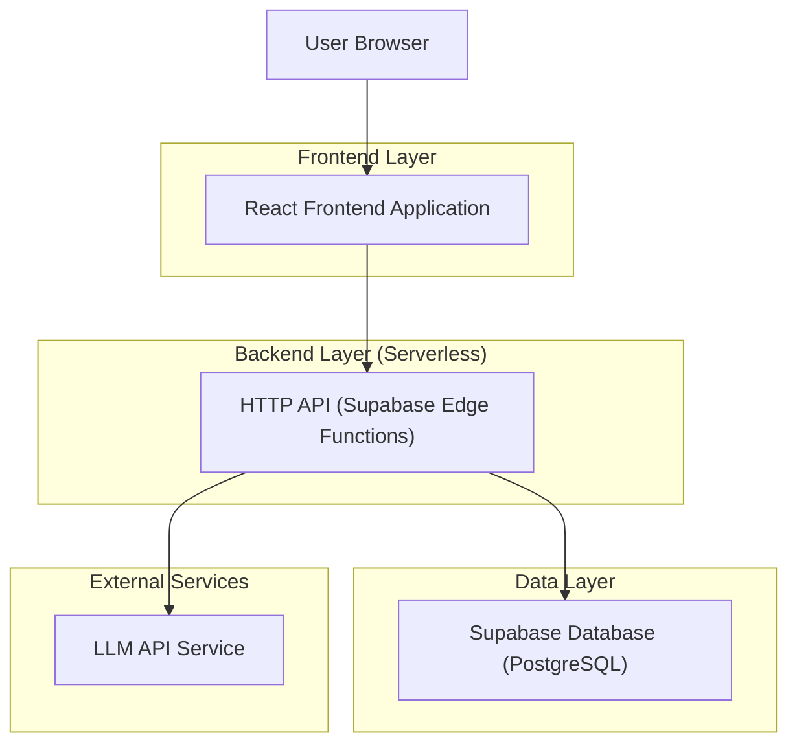
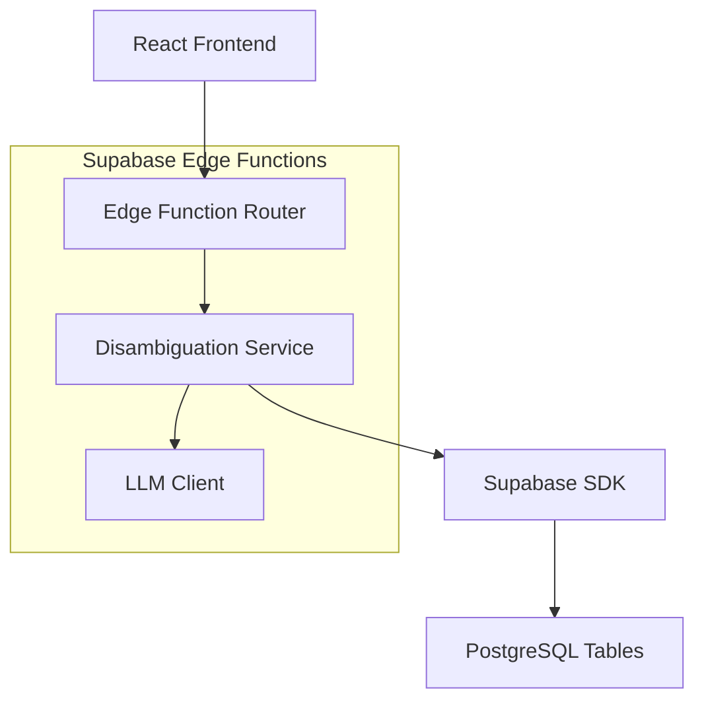
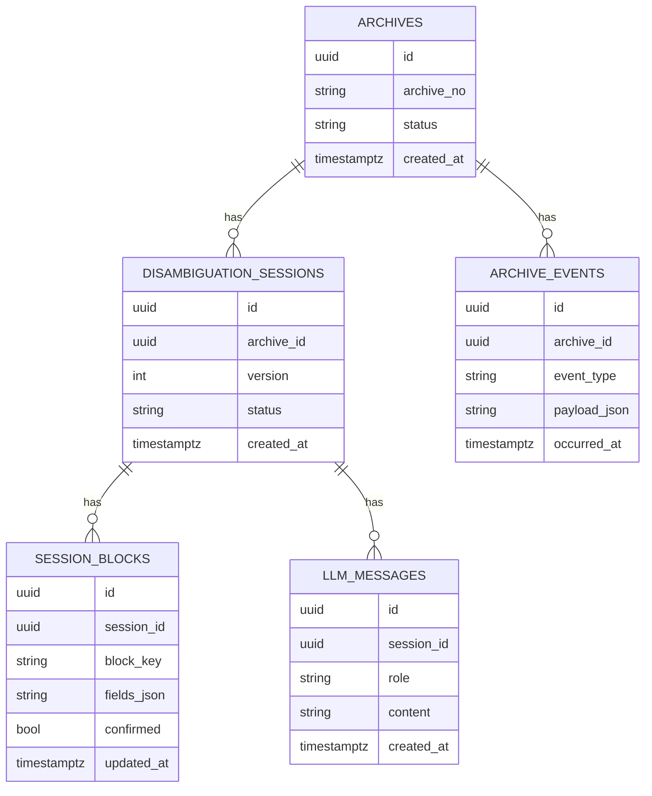

## 1.Architecture design


## 2.Technology Description
- Frontend: React@18 + vite + TypeScript + tailwindcss@3 + react-router + @tanstack/react-query
- Backend: Supabase Edge Functions (Deno) + Supabase Database (PostgreSQL)
- LLM: OpenAI-compatible Chat Completions API（密钥仅存于 Edge Functions 环境变量）

## 3.Route definitions
| Route | Purpose |
|-------|---------|
| /archives | 档案列表页：检索/筛选并进入工作台 |
| /disambiguation/:archiveId | CoT 路由消歧工作台：六块确认、LLM 消歧、最终确认、回放 |

## 4.API definitions (If it includes backend services)
### 4.1 Shared TypeScript types（前后端共享）
```ts
export type UUID = string;

export type ArchiveStatus = "new" | "in_progress" | "done" | "error";

export type ArchiveSummary = {
  id: UUID;
  archiveNo: string;
  status: ArchiveStatus;
  createdAt: string;
};

export type InfoBlockKey = "block1" | "block2" | "block3" | "block4" | "block5" | "block6";

export type FieldValue = {
  key: string;              // 字段名
  value: string | null;
  required: boolean;
  evidenceRefs: string[];   // 引用片段/证据ID
  conflict?: boolean;
};

export type InfoBlock = {
  blockKey: InfoBlockKey;
  title: string;
  fields: FieldValue[];
  confirmed: boolean;
};

export type DisambiguationSession = {
  id: UUID;
  archiveId: UUID;
  version: number;
  status: "editing" | "finalized";
  createdAt: string;
};

export type LlmMessage = {
  role: "system" | "user" | "assistant";
  content: string;
  createdAt: string;
};
```

### 4.2 Core API
1) 档案列表
```
GET /api/archives
```
Response: `ArchiveSummary[]`

2) 获取档案详情（含 6 块、缺失/冲突标记、回放事件索引）
```
GET /api/archives/:archiveId
```

3) 创建/获取当前消歧会话
```
POST /api/disambiguation/sessions
```
Request:
| Param Name| Param Type  | isRequired  | Description |
|-----------|-------------|-------------|-------------|
| archiveId | UUID | true | 档案ID |

4) LLM 交互（用于消歧/补齐）
```
POST /api/disambiguation/:sessionId/llm
```
Request:
| Param Name| Param Type  | isRequired  | Description |
|-----------|-------------|-------------|-------------|
| blockKey | InfoBlockKey | true | 触发消歧的块 |
| prompt | string | true | 你输入的问题/指令 |
| contextFieldKeys | string[] | false | 相关字段集合 |

5) 保存块级确认/字段变更
```
POST /api/disambiguation/:sessionId/confirm-block
```
Request:
| Param Name| Param Type  | isRequired  | Description |
|-----------|-------------|-------------|-------------|
| blockKey | InfoBlockKey | true | 块标识 |
| fields | {key: string; value: string|null;}[] | true | 最终字段值 |
| reason | string | false | 变更原因/采纳说明 |

6) 最终确认（生成结果版本并锁定）
```
POST /api/disambiguation/:sessionId/finalize
```

7) 获取回放事件流
```
GET /api/archives/:archiveId/replay
```

## 5.Server architecture diagram (If it includes backend services)


## 6.Data model(if applicable)
### 6.1 Data model definition


### 6.2 Data Definition Language
Archives（archives）
```sql
CREATE TABLE archives (
  id UUID PRIMARY KEY DEFAULT gen_random_uuid(),
  archive_no TEXT NOT NULL,
  status TEXT NOT NULL DEFAULT 'new',
  created_at TIMESTAMPTZ NOT NULL DEFAULT NOW()
);
CREATE INDEX idx_archives_created_at ON archives(created_at DESC);
```

Archive events（archive_events）
```sql
CREATE TABLE archive_events (
  id UUID PRIMARY KEY DEFAULT gen_random_uuid(),
  archive_id UUID NOT NULL,
  event_type TEXT NOT NULL,
  payload_json JSONB NOT NULL,
  occurred_at TIMESTAMPTZ NOT NULL DEFAULT NOW()
);
CREATE INDEX idx_archive_events_archive_id ON archive_events(archive_id);
CREATE INDEX idx_archive_events_occurred_at ON archive_events(occurred_at DESC);
```

Disambiguation sessions（disambiguation_sessions）
```sql
CREATE TABLE disambiguation_sessions (
  id UUID PRIMARY KEY DEFAULT gen_random_uuid(),
  archive_id UUID NOT NULL,
  version INT NOT NULL DEFAULT 1,
  status TEXT NOT NULL DEFAULT 'editing',
  created_at TIMESTAMPTZ NOT NULL DEFAULT NOW()
);
CREATE INDEX idx_sessions_archive_id ON disambiguation_sessions(archive_id);
```

Session blocks（session_blocks）
```sql
CREATE TABLE session_blocks (
  id UUID PRIMARY KEY DEFAULT gen_random_uuid(),
  session_id UUID NOT NULL,
  block_key TEXT NOT NULL,
  fields_json JSONB NOT NULL,
  confirmed BOOLEAN NOT NULL DEFAULT FALSE,
  updated_at TIMESTAMPTZ NOT NULL DEFAULT NOW()
);
CREATE INDEX idx_blocks_session_id ON session_blocks(session_id);
```

LLM messages（llm_messages）
```sql
CREATE TABLE llm_messages (
  id UUID PRIMARY KEY DEFAULT gen_random_uuid(),
  session_id UUID NOT NULL,
  role TEXT NOT NULL,
  content TEXT NOT NULL,
  created_at TIMESTAMPTZ NOT NULL DEFAULT NOW()
);
CREATE INDEX idx_llm_messages_session_id ON llm_messages(session_id);
CREATE INDEX idx_llm_messages_created_at ON llm_messages(created_at DESC);
```

权限建议（按 Supabase guideline，早期可简化为只读公开 + 写入需登录）
```sql
GRANT SELECT ON archives TO anon;
GRANT SELECT ON archive_events TO anon;
GRANT SELECT ON disambiguation_sessions TO anon;
GRANT SELECT ON session_blocks TO anon;
GRANT SELECT ON llm_messages TO anon;

GRANT ALL PRIVILEGES ON archives TO authenticated;
GRANT ALL PRIVILEGES ON archive_events TO authenticated;
GRANT ALL PRIVILEGES ON disambiguation_sessions TO authenticated;
GRANT ALL PRIVILEGES ON session_blocks TO authenticated;
GRANT ALL PRIVILEGES ON llm_messages TO authenticated;
```