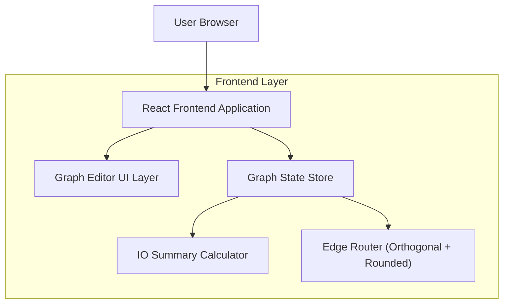

## 1.Architecture design


## 2.Technology Description
- Frontend: React@18 + TypeScript + vite
- UI/Canvas: reactflow（节点/连线渲染与交互基础）+ 自定义 Edge（正交走线 + 圆角）
- State: zustand（集中管理 nodes/edges、选择态、历史栈）
- Data validation (optional but recommended): zod（校验连接规则与端口定义）
- Backend: None

核心前端数据结构（共享于UI/计算逻辑）：
```ts
export type PortDirection = 'input' | 'output'

export type PortDef = {
  id: string
  name: string
  direction: PortDirection
  schemaKey?: string // 用于全图汇总时的字段/类型标识
}

export type NodeData = {
  label: string
  ports: PortDef[]
}

export type GraphNode = {
  id: string
  type: string // 节点类型（来自节点库）
  position: { x: number; y: number }
  data: NodeData
}

export type GraphEdge = {
  id: string
  source: string
  sourceHandle: string // 输出端口id
  target: string
  targetHandle: string // 输入端口id
}

export type IOSummary = {
  globalInputs: Array<{ nodeId: string; portId: string; schemaKey?: string }>
  globalOutputs: Array<{ nodeId: string; portId: string; schemaKey?: string }>
  connections: Array<{ from: { nodeId: string; portId: string }; to: { nodeId: string; portId: string } }>
}
```

实现要点（规格级）：
- 节点可拖拽：基于 reactflow 的 draggable nodes；开启 snap-to-grid 或自定义吸附。
- 连线创建：从输出端口拖拽到输入端口；在 onConnect 时做连接合法性校验（方向、重复、同端口多连策略）。
- 正交圆角连线：
  - 路径生成采用“正交分段 + 圆角过渡”的策略；优先使用 SmoothStep 类走线或自定义 path 计算（基于 source/target 位置与 handle 方向）。
  - 节点移动/端口位置变化时触发重算；边渲染只依赖 nodes/edges 的可观察状态。
- 全图IO汇总：
  - 全局输入：所有 input 端口中“未被任何 edge.targetHandle 消费”的端口集合。
  - 全局输出：所有 output 端口中“未被任何 edge.sourceHandle 输出给下游”的端口集合。
  - 连接摘要：edges 映射为 from/to 对。
  - 计算应纯函数化：IOSummary = f(nodes, edges)，用于右侧面板实时渲染。

## 3.Route definitions
| Route | Purpose |
|-------|---------|
| / | 画布编辑器页：节点拖拽、正交圆角连线、右侧全图IO汇总面板 |
