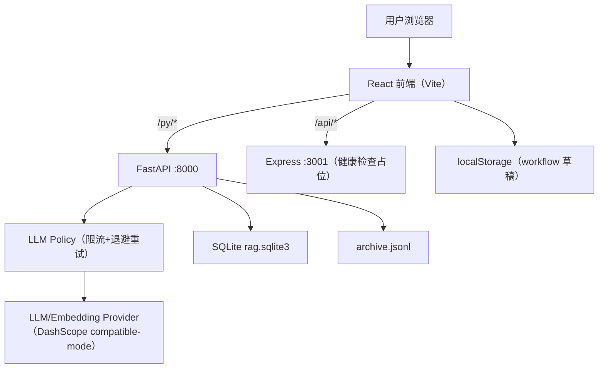

## 1. Architecture Design

## 2. Implementation Mapping（与代码一致）

### 2.1 索引限流与 429 退避

当前实现位于后端：
- `backend/app/services/llm_policy.py`

能力：
- 全局并发上限（信号量）
- 1 分钟窗口内请求次数上限（滑动窗口）
- 429/5xx/timeout 等可重试错误指数退避（优先尊重 `Retry-After`）

环境变量：
- `AI_CBDES_LLM_MAX_CONCURRENCY`（默认 2）
- `AI_CBDES_LLM_MAX_REQUESTS_PER_MIN`（默认 50）
- `AI_CBDES_LLM_RETRY_MAX_ATTEMPTS`（默认 8）
- `AI_CBDES_LLM_RETRY_BASE_SECONDS`（默认 1.0）
- `AI_CBDES_LLM_RETRY_MAX_SECONDS`（默认 60.0）

### 2.2 图形化搭建（Graph Builder）

当前实现为“可用交互 + 本地保存”的 MVP：
- 左侧从 RAG 后端读取模块/函数：`GET /rag/modules`、`GET /rag/functions`
- 画布拖拽节点/连线：前端内存状态
- 保存草稿：localStorage（key：`online:workflows`）
- 写入档案：`POST /archive/events`（type：`workflow.saved`）
- 节点测试：复用 `POST /rag/test-run`

## 3. Technology Description
- Frontend: React@18 + TypeScript + Vite + TailwindCSS + Ant Design
- Backend:
  - FastAPI（RAG/档案/任务分析等）
  - Express（占位健康检查）
- Storage:
  - SQLite（RAG functions + embeddings）
  - JSONL（Archive 事件）
- AI: DashScope OpenAI 兼容接口（通过 `openai` Python SDK）

## 4. Route Definitions
| Route | Purpose |
|-------|---------|
| `/offline/rag` | 索引管理：扫描/索引任务/补全描述/检索/函数详情 |
| `/online/graph-builder` | 图形化搭建：函数拖拽编排、保存与测试 |

## 5. API Definitions（按当前 FastAPI）

### 5.1 索引任务
- `POST /rag/index-job`
- `GET /rag/index-job/{job_id}`
- `POST /rag/index-job/{job_id}/cancel`

### 5.2 缺失描述补全
- `POST /rag/backfill-docs-job`
- `GET /rag/backfill-docs-job/{job_id}`
- `POST /rag/backfill-docs-job/{job_id}/cancel`

### 5.3 图形化搭建依赖
- `GET /rag/modules`
- `GET /rag/functions`
- `POST /rag/test-run`
- `POST /archive/events`

## 6. Data Model

### 6.1 SQLite（RAG）
- `functions` 表存储：函数切片、增强描述（`doc_zh/doc_en`）与向量。

### 6.2 Workflow 草稿与档案
- 草稿：localStorage（浏览器端）
- 档案：`archive.jsonl`（服务端事件流）
