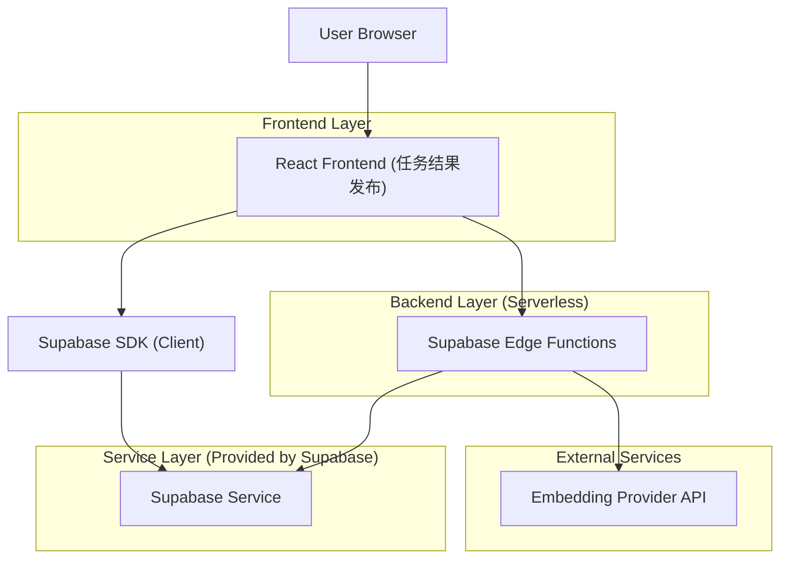
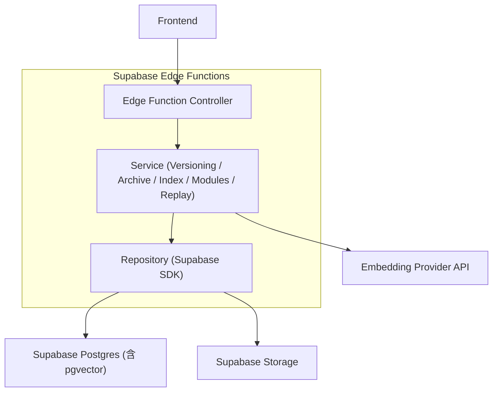
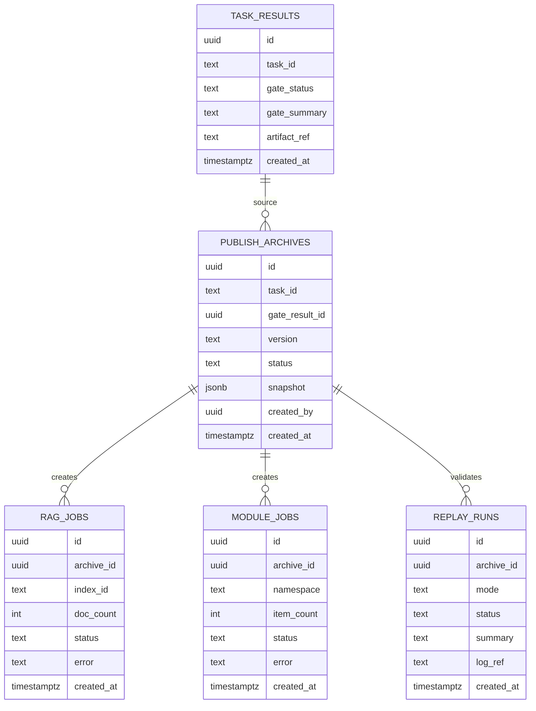

## 1.Architecture design


## 2.Technology Description
- Frontend: React@18 + TypeScript + vite + tailwindcss
- Backend: Supabase（Auth / Postgres / Storage / Edge Functions）
- Vector/RAG: Supabase Postgres + pgvector（向量列）
- Embedding: 第三方 Embedding API（Key 仅存于 Edge Functions 环境变量；前端不接触）

## 3.Route definitions
| Route | Purpose |
|-------|---------|
| /publish | 任务结果发布：版本号生成、入库、回放、发布落档 |
| /publish/archives | 发布档案列表与筛选 |
| /publish/archives/:archiveId | 发布档案详情与“跳转加载” |
| /publish/replay/:archiveId | 基于发布快照回放（也可从发布页进入） |

## 4.API definitions (If it includes backend services)
### 4.1 Core API
> 以 Supabase Edge Functions 形式提供（路径示例）。

1) 创建发布（生成版本号 + 形成快照 + 落档）
```
POST /functions/v1/publish/create
```
Request:
| Param Name | Param Type | isRequired | Description |
|-----------|------------|-----------|-------------|
| taskId | string | true | 任务 ID |
| gateResultId | string | true | 门禁通过的生成结果 ID |
| rag | { indexId?: string; createIndexName?: string; mode: 'skip'|'index' } | true | RAG 入库参数 |
| modules | { namespace: string; mode: 'skip'|'upsert' } | true | 模块入库参数 |
| includeReplay | boolean | false | 是否在创建后触发回放 |

Response:
| Param Name | Param Type | Description |
|-----------|------------|-------------|
| archiveId | string | 发布档案 ID |
| version | string | 版本号 |
| status | 'ok'|'partial'|'failed' | 发布结果 |

2) 执行 RAG 入库
```
POST /functions/v1/rag/index
```
Request:
| Param Name | Param Type | isRequired | Description |
|-----------|------------|-----------|-------------|
| archiveId | string | true | 发布档案 ID（用于追溯与回放） |
| indexId | string | true | RAG 索引 ID |
| documents | Array<{ docId: string; contentRef: string; metadata: Record<string, any> }> | true | 待入库内容引用（文本或存储引用） |

3) 模块入库
```
POST /functions/v1/modules/upsert
```
Request:
| Param Name | Param Type | isRequired | Description |
|-----------|------------|-----------|-------------|
| archiveId | string | true | 发布档案 ID |
| namespace | string | true | 命名空间 |
| items | Array<{ moduleKey: string; artifactRef: string; meta: Record<string, any> }> | true | 模块条目与产物引用 |

4) 获取档案详情 / 用于跳转加载
```
GET /functions/v1/archives/:archiveId
```
Response（核心字段）:
| Param Name | Param Type | Description |
|-----------|------------|-------------|
| archive | PublishArchive | 档案详情（含快照） |

5) 回放
```
POST /functions/v1/replay/run
```
Request:
| Param Name | Param Type | isRequired | Description |
|-----------|------------|-----------|-------------|
| archiveId | string | true | 发布档案 ID |
| mode | 'validate'|'debug' | true | 回放模式 |

### 4.2 Shared TypeScript Types
```ts
export type GateStatus = 'passed' | 'failed' | 'unknown'

export type TaskResult = {
  id: string
  taskId: string
  gateStatus: GateStatus
  gateSummary?: string
  artifactRef: string
  createdAt: string
}

export type PublishSnapshot = {
  taskId: string
  gateResultId: string
  version: string
  rag?: { indexId: string; docCount: number; status: 'skipped'|'ok'|'failed'; error?: string }
  modules?: { namespace: string; itemCount: number; status: 'skipped'|'ok'|'failed'; error?: string }
}

export type PublishArchive = {
  id: string
  taskId: string
  version: string
  createdBy: string
  createdAt: string
  status: 'ok'|'partial'|'failed'
  snapshot: PublishSnapshot
  replay?: { status: 'skipped'|'ok'|'failed'; summary?: string; logRef?: string }
}
```

## 5.Server architecture diagram (If it includes backend services)


## 6.Data model(if applicable)
### 6.1 Data model definition


### 6.2 Data Definition Language
Task Results（task_results）
```sql
CREATE TABLE task_results (
  id UUID PRIMARY KEY DEFAULT gen_random_uuid(),
  task_id TEXT NOT NULL,
  gate_status TEXT NOT NULL CHECK (gate_status IN ('passed','failed','unknown')),
  gate_summary TEXT,
  artifact_ref TEXT NOT NULL,
  created_at TIMESTAMPTZ DEFAULT NOW()
);
CREATE INDEX idx_task_results_task_id ON task_results(task_id);
CREATE INDEX idx_task_results_gate_status ON task_results(gate_status);

GRANT SELECT ON task_results TO anon;
GRANT ALL PRIVILEGES ON task_results TO authenticated;
```

Publish Archives（publish_archives）
```sql
CREATE TABLE publish_archives (
  id UUID PRIMARY KEY DEFAULT gen_random_uuid(),
  task_id TEXT NOT NULL,
  gate_result_id UUID NOT NULL,
  version TEXT NOT NULL,
  status TEXT NOT NULL CHECK (status IN ('ok','partial','failed')),
  snapshot JSONB NOT NULL,
  created_by UUID NOT NULL,
  created_at TIMESTAMPTZ DEFAULT NOW()
);
CREATE UNIQUE INDEX uq_publish_archives_task_version ON publish_archives(task_id, version);
CREATE INDEX idx_publish_archives_task_id ON publish_archives(task_id);
CREATE INDEX idx_publish_archives_created_at ON publish_archives(created_at DESC);

GRANT SELECT ON publish_archives TO anon;
GRANT ALL PRIVILEGES ON publish_archives TO authenticated;
```

RAG Jobs（rag_jobs）
```sql
CREATE TABLE rag_jobs (
  id UUID PRIMARY KEY DEFAULT gen_random_uuid(),
  archive_id UUID NOT NULL,
  index_id TEXT NOT NULL,
  doc_count INT DEFAULT 0,
  status TEXT NOT NULL CHECK (status IN ('skipped','ok','failed','running')),
  error TEXT,
  created_at TIMESTAMPTZ DEFAULT NOW()
);
CREATE INDEX idx_rag_jobs_archive_id ON rag_jobs(archive_id);

GRANT SELECT ON rag_jobs TO anon;
GRANT ALL PRIVILEGES ON rag_jobs TO authenticated;
```

Module Jobs（module_jobs）
```sql
CREATE TABLE module_jobs (
  id UUID PRIMARY KEY DEFAULT gen_random_uuid(),
  archive_id UUID NOT NULL,
  namespace TEXT NOT NULL,
  item_count INT DEFAULT 0,
  status TEXT NOT NULL CHECK (status IN ('skipped','ok','failed','running')),
  error TEXT,
  created_at TIMESTAMPTZ DEFAULT NOW()
);
CREATE INDEX idx_module_jobs_archive_id ON module_jobs(archive_id);

GRANT SELECT ON module_jobs TO anon;
GRANT ALL PRIVILEGES ON module_jobs TO authenticated;
```

Replay Runs（replay_runs）
```sql
CREATE TABLE replay_runs (
  id UUID PRIMARY KEY DEFAULT gen_random_uuid(),
  archive_id UUID NOT NULL,
  mode TEXT NOT NULL CHECK (mode IN ('validate','debug')),
  status TEXT NOT NULL CHECK (status IN ('skipped','ok','failed','running')),
  summary TEXT,
  log_ref TEXT,
  created_at TIMESTAMPTZ DEFAULT NOW()
);
CREATE INDEX idx_replay_runs_archive_id ON replay_runs(archive_id);

GRANT SELECT ON replay_runs TO anon;
GRANT ALL PRIVILEGES ON replay_runs TO authenticated;
```

> 版本号生成建议：Edge Function 在创建档案时按“task_id + gate_result_id + 时间/序列”生成不可变版本（并以 uq_publish_archives_task_version 保证唯一）。
