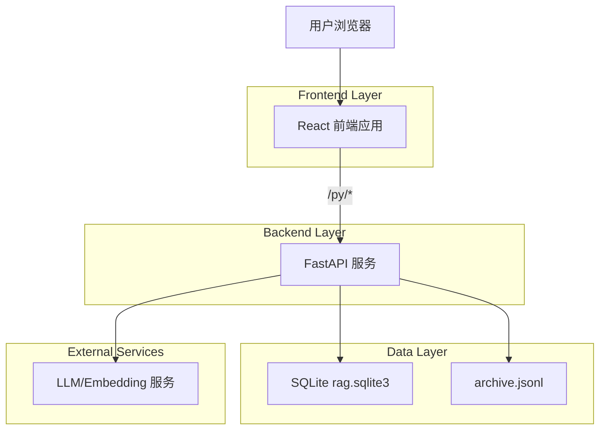
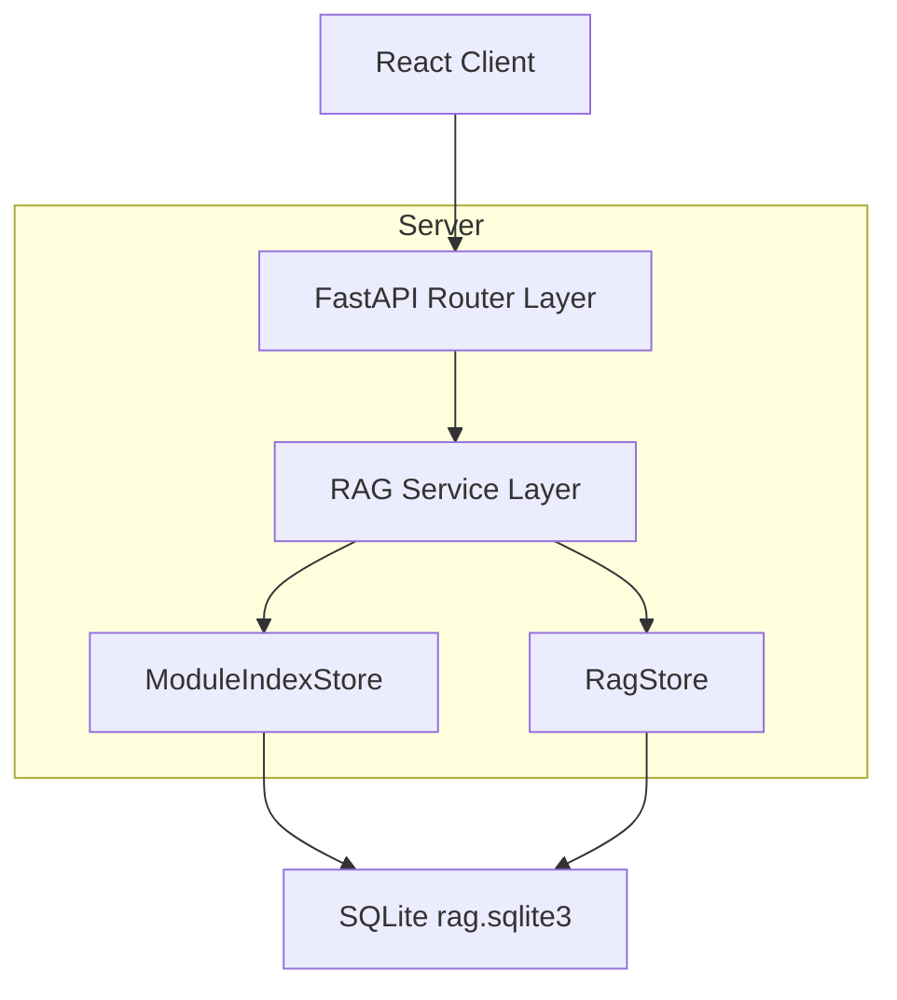
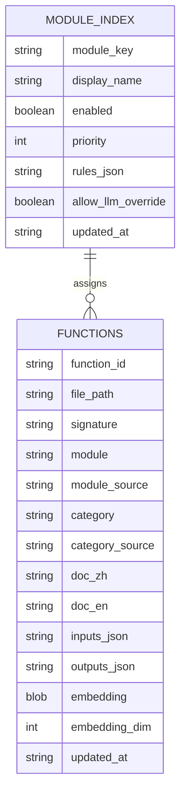

## 1.Architecture design


## 2.Technology Description
- Frontend: React@18 + TypeScript + Vite + TailwindCSS + Ant Design
- Backend: FastAPI + Uvicorn
- Database: SQLite（本地文件 rag.sqlite3）

## 3.Route definitions
| Route | Purpose |
|-------|---------|
| `/offline/rag` | RAG 管理（索引/检索/函数库/模块维护） |
| `/online/graph-builder` | 图形化搭建（函数拖拽编排、属性与测试） |

## 4.API definitions (If it includes backend services)
### 4.1 Core API
模块索引维护
- `GET /rag/module-index?root_dir=...`：获取模块定义列表与规则
- `PUT /rag/module-index`：新增/更新模块定义（含规则、启用状态、优先级）

函数元数据维护（支持三类分类）
- `GET /rag/functions?root_dir=&module=&category=&q=&limit=&offset=`：列表（新增 category 过滤）
- `GET /rag/function?function_id=...`：详情（返回 module/category 及来源字段）
- `PUT /rag/function/metadata`：更新 display_name/module/category/doc（可选 reset_embedding）

索引任务（改造点：落库时写入 module/category 与来源）
- `POST /rag/index-job` / `GET /rag/index-job/{job_id}` / `POST /rag/index-job/{job_id}/cancel`

通用类型（前后端共享，TypeScript）
```ts
type FunctionCategory = 'callable' | 'domain' | 'utility'

type ModuleRule = {
  kind: 'path_prefix' | 'path_regex'
  pattern: string
}

type ModuleIndexItem = {
  module_key: string
  display_name: string
  enabled: boolean
  priority: number
  rules: ModuleRule[]
  allow_llm_override: boolean
  updated_at: string
}

type FunctionIndexItem = {
  function_id: string
  display_name: string
  module: string
  module_source: 'manual' | 'rule' | 'llm' | 'heuristic'
  category: FunctionCategory
  category_source: 'manual' | 'rule' | 'llm' | 'heuristic'
  file_path: string
  signature: string
  embedded: number
  updated_at: string
}
```

## 5.Server architecture diagram (If it includes backend services)


## 6.Data model(if applicable)
### 6.1 Data model definition


### 6.2 Data Definition Language
`rag.sqlite3` 迁移建议（向后兼容，使用 ALTER TABLE + 新表）：
```sql
-- 1) functions 新增字段（若不存在）
ALTER TABLE functions ADD COLUMN category TEXT NOT NULL DEFAULT 'utility';
ALTER TABLE functions ADD COLUMN category_source TEXT NOT NULL DEFAULT 'heuristic';
ALTER TABLE functions ADD COLUMN module_source TEXT NOT NULL DEFAULT 'heuristic';

-- 2) 模块索引表
CREATE TABLE IF NOT EXISTS module_index (
  module_key TEXT PRIMARY KEY,
  display_name TEXT NOT NULL,
  enabled INTEGER NOT NULL DEFAULT 1,
  priority INTEGER NOT NULL DEFAULT 100,
  rules_json TEXT NOT NULL DEFAULT '[]',
  allow_llm_override INTEGER NOT NULL DEFAULT 1,
  updated_at TEXT NOT NULL
);

CREATE INDEX IF NOT EXISTS idx_functions_category ON functions(category);
CREATE INDEX IF NOT EXISTS idx_functions_module_source ON functions(module_source);
```

### 6.3 模块发现规则（落库写入 module/module_source）
优先级从高到低：
1) **手动覆盖**：函数详情中手动设置 module/category。
2) **模块索引规则命中**：按 module_index.priority 升序匹配 rules（path_prefix/path_regex），首个命中即定。
3) **LLM 结果**：仅当 module.allow_llm_override=true 且返回值在 module_index.enabled 列表内。
4) **路径启发式**：沿用关键词猜测（例如 perception/planning/control 等）。
5) **兜底**：`common`。

分类规则（落库写入 category/category_source）：
- 优先手动覆盖；否则可用规则：例如命中 `*/test/*` → `utility`，命中“入口/流程/管线”命名 → `callable`；其余默认 `domain` 或 `utility`（按你现有仓库习惯配置）。
