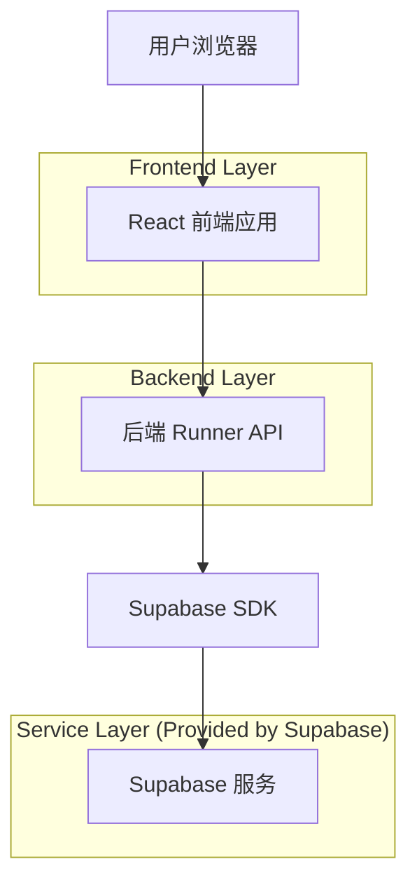
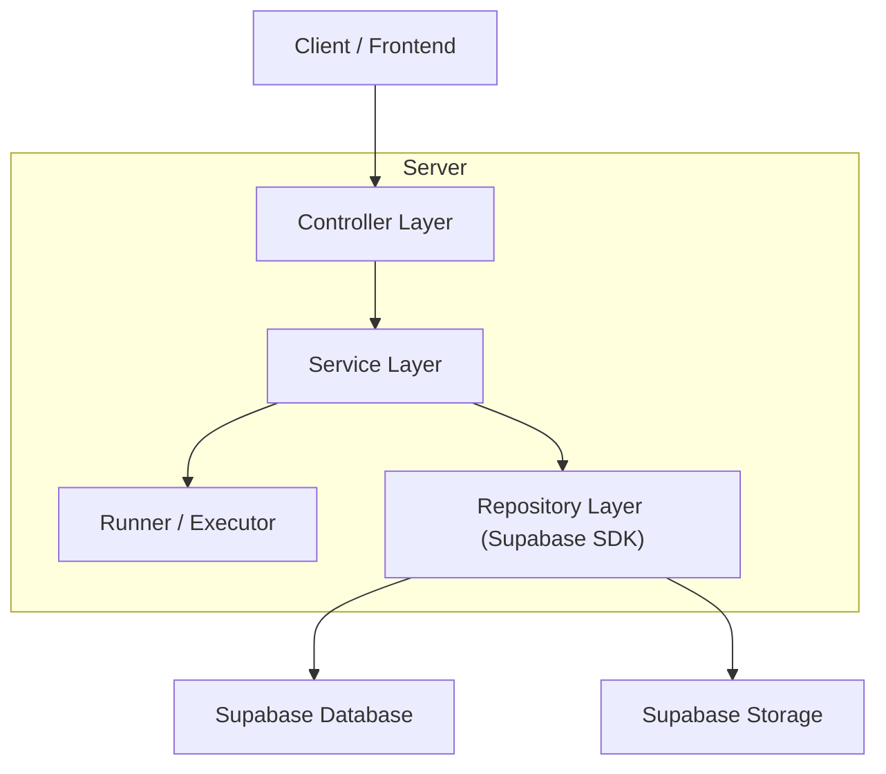
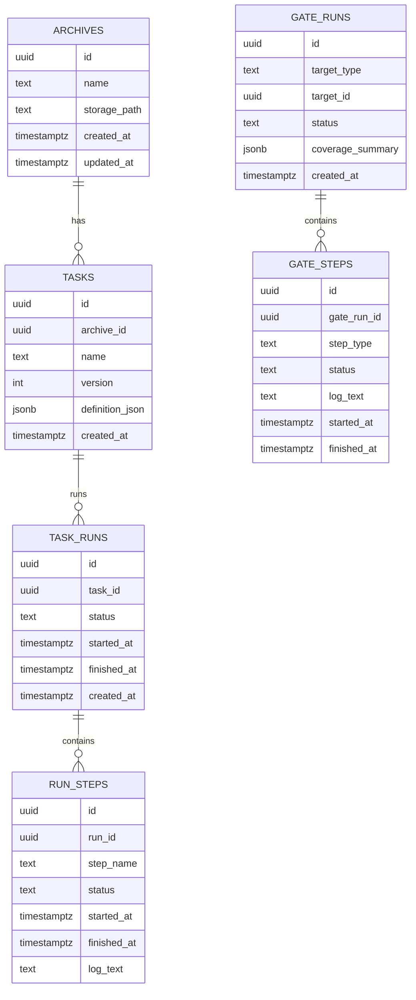

## 1.Architecture design


说明：
- “函数编排与生成”的持久化与回放数据写入 Supabase。
- “测试门禁”的编译/静态/单测/覆盖率需要实际执行命令，因此提供一个最小后端 Runner API 在受控环境中运行，并把状态、日志、报告写回 Supabase。

## 2.Technology Description
- Frontend: React@18 + TypeScript + vite + tailwindcss@3
- Backend: Node.js@20 + Express@4（Runner API，执行门禁步骤与任务运行）
- Database & Storage: Supabase（PostgreSQL + Storage）

## 3.Route definitions
| Route | Purpose |
|-------|---------|
| / | 首页，入口导航与最近概览 |
| /orchestrator | 函数编排与生成：档案选择、任务生成、保存、运行与回放 |
| /gate | 测试门禁：配置步骤、触发、日志与覆盖率展示 |

## 4.API definitions (If it includes backend services)

### 4.1 Core Types (TypeScript)
```ts
export type ID = string;

export type Archive = {
  id: ID;
  name: string;
  storage_path: string;
  created_at: string;
  updated_at: string;
};

// 任务定义（可导出 JSON/YAML，服务端统一以 JSON 存储）
export type OrchestratedTask = {
  id: ID;
  archive_id: ID;
  name: string;
  version: number;
  definition_json: unknown;
  created_at: string;
};

export type TaskRunStatus = "queued" | "running" | "success" | "failed" | "canceled";

export type TaskRun = {
  id: ID;
  task_id: ID;
  status: TaskRunStatus;
  started_at?: string;
  finished_at?: string;
};

export type RunStep = {
  id: ID;
  run_id: ID;
  step_name: string;
  status: TaskRunStatus;
  started_at?: string;
  finished_at?: string;
  log_text?: string;
};

export type GateStepType = "compile" | "static" | "unit" | "coverage";

export type GateRun = {
  id: ID;
  target_type: "archive" | "task";
  target_id: ID;
  status: TaskRunStatus;
  created_at: string;
};

export type CoverageSummary = {
  lines_pct?: number;
  branches_pct?: number;
  functions_pct?: number;
  statements_pct?: number;
};
```

### 4.2 Runner API
#### 触发任务运行
```
POST /api/task-runs
```
Request:
| Param Name| Param Type | isRequired | Description |
|---|---|---:|---|
| taskId | string | true | 任务 ID |

Response:
| Param Name| Param Type | Description |
|---|---|---|
| runId | string | 创建的运行 ID |

#### 获取任务运行详情（含步骤与日志）
```
GET /api/task-runs/:runId
```

#### 触发门禁运行
```
POST /api/gate-runs
```
Request:
| Param Name| Param Type | isRequired | Description |
|---|---|---:|---|
| targetType | "archive" \| "task" | true | 验证对象类型 |
| targetId | string | true | 验证对象 ID |
| steps | GateStepType[] | true | 执行步骤顺序（编译/静态/单测/覆盖率） |

Response:
| Param Name| Param Type | Description |
|---|---|---|
| gateRunId | string | 门禁运行 ID |

#### 获取门禁运行详情（含分步骤日志与覆盖率汇总）
```
GET /api/gate-runs/:gateRunId
```

## 5.Server architecture diagram (If it includes backend services)


## 6.Data model(if applicable)

### 6.1 Data model definition


### 6.2 Data Definition Language
ARCHIVES
```
CREATE TABLE archives (
  id UUID PRIMARY KEY DEFAULT gen_random_uuid(),
  name TEXT NOT NULL,
  storage_path TEXT NOT NULL,
  created_at TIMESTAMPTZ NOT NULL DEFAULT NOW(),
  updated_at TIMESTAMPTZ NOT NULL DEFAULT NOW()
);

GRANT SELECT ON archives TO anon;
GRANT ALL PRIVILEGES ON archives TO authenticated;
```

TASKS
```
CREATE TABLE tasks (
  id UUID PRIMARY KEY DEFAULT gen_random_uuid(),
  archive_id UUID NOT NULL,
  name TEXT NOT NULL,
  version INT NOT NULL DEFAULT 1,
  definition_json JSONB NOT NULL,
  created_at TIMESTAMPTZ NOT NULL DEFAULT NOW()
);

CREATE INDEX idx_tasks_archive_id ON tasks(archive_id);
GRANT SELECT ON tasks TO anon;
GRANT ALL PRIVILEGES ON tasks TO authenticated;
```

TASK_RUNS / RUN_STEPS
```
CREATE TABLE task_runs (
  id UUID PRIMARY KEY DEFAULT gen_random_uuid(),
  task_id UUID NOT NULL,
  status TEXT NOT NULL,
  started_at TIMESTAMPTZ,
  finished_at TIMESTAMPTZ,
  created_at TIMESTAMPTZ NOT NULL DEFAULT NOW()
);

CREATE INDEX idx_task_runs_task_id ON task_runs(task_id);
GRANT SELECT ON task_runs TO anon;
GRANT ALL PRIVILEGES ON task_runs TO authenticated;

CREATE TABLE run_steps (
  id UUID PRIMARY KEY DEFAULT gen_random_uuid(),
  run_id UUID NOT NULL,
  step_name TEXT NOT NULL,
  status TEXT NOT NULL,
  started_at TIMESTAMPTZ,
  finished_at TIMESTAMPTZ,
  log_text TEXT
);

CREATE INDEX idx_run_steps_run_id ON run_steps(run_id);
GRANT SELECT ON run_steps TO anon;
GRANT ALL PRIVILEGES ON run_steps TO authenticated;
```

GATE_RUNS / GATE_STEPS
```
CREATE TABLE gate_runs (
  id UUID PRIMARY KEY DEFAULT gen_random_uuid(),
  target_type TEXT NOT NULL,
  target_id UUID NOT NULL,
  status TEXT NOT NULL,
  coverage_summary JSONB,
  created_at TIMESTAMPTZ NOT NULL DEFAULT NOW()
);

CREATE INDEX idx_gate_runs_target ON gate_runs(target_type, target_id);
GRANT SELECT ON gate_runs TO anon;
GRANT ALL PRIVILEGES ON gate_runs TO authenticated;

CREATE TABLE gate_steps (
  id UUID PRIMARY KEY DEFAULT gen_random_uuid(),
  gate_run_id UUID NOT NULL,
  step_type TEXT NOT NULL,
  status TEXT NOT NULL,
  log_text TEXT,
  started_at TIMESTAMPTZ,
  finished_at TIMESTAMPTZ
);

CREATE INDEX idx_gate_steps_gate_run_id ON gate_steps(gate_run_id);
GRANT SELECT ON gate_steps TO anon;
GRANT ALL PRIVILEGES ON gate_steps TO authenticated;
```